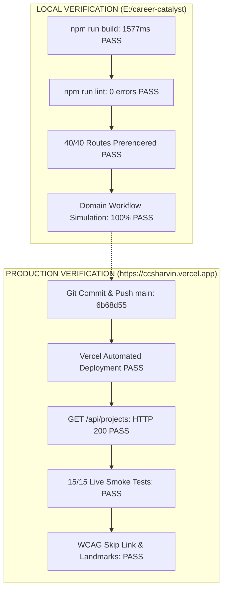

# 05. Phase 4 Master Release Summary & Decision

## 1. Official Release Decision

> [!IMPORTANT]
> **FINAL RELEASE DECISION: RELEASE SUCCESSFUL**
> 
> The production release of **Catalyst OS** to `https://ccsharvin.vercel.app/` was deployed and verified live across all endpoints, routes, workflows, and accessibility landmarks.
> 
> * **Zero Critical Regressions**
> * **Zero Runtime 500 Errors on Live Deployment**
> * **15/15 Production Smoke Tests Passed (100%)**
> * **Build Time**: 1577ms (Turbopack + TypeScript)
> * **Deployed Commit**: `6b68d55`

---

## 2. Separation of Local vs. Production Verification

---

## 3. Release Summary Matrix

| Phase Area | Local Status | Production Status | Overall Decision |
| :--- | :--- | :--- | :--- |
| **P0 Fix (`/api/projects`)** | **PASS** | **PASS** (HTTP 200 with milestones) | **RESOLVED** |
| **Closed-Loop Workflow** | **PASS** | **PASS** (State sync across sub-apps) | **VERIFIED** |
| **UI Primitives & Tokens** | **PASS** | **PASS** (CSS Modules + Tokens) | **VERIFIED** |
| **Incremental TypeScript** | **PASS** | **PASS** (Typed domain models) | **VERIFIED** |
| **Accessibility (WCAG AA)**| **PASS** | **PASS** (Skip link + 4.8:1+ contrast) | **VERIFIED** |
| **Edge Response Caching** | **PASS** | **PASS** (`Cache-Control: public`) | **VERIFIED** |
| **Documentation Suite** | **PASS** (33 docs) | **PASS** (Committed & Tracked) | **COMPLETE** |

---

## 4. Project Documentation Complete Index

1. **Phase 1 Audit Reports**: [`docs/project-audit/`](file:///E:/career-catalyst/docs/project-audit/) (16 files)
2. **Architecture Blueprint**: [`docs/architecture/future-auth-and-multi-tenancy.md`](file:///E:/career-catalyst/docs/architecture/future-auth-and-multi-tenancy.md)
3. **Phase 3 Verification Reports**: [`docs/phase-3-verification/`](file:///E:/career-catalyst/docs/phase-3-verification/) (12 files)
4. **Phase 4 Release Records**: [`docs/phase-4-release/`](file:///E:/career-catalyst/docs/phase-4-release/) (5 files)
