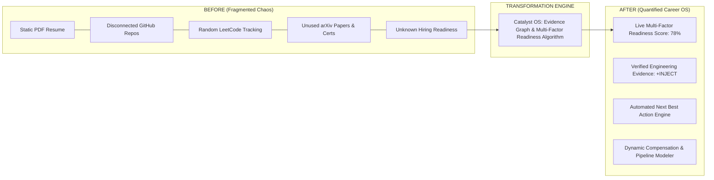

# 01. Product Definition & Value Proposition Analysis

## 1. Executive Product Definition

**Catalyst OS** is a **Career Operating System for Machine Learning & Systems Engineers**. 

It is designed to replace fragmented developer tooling (spreadsheets, LeetCode trackers, resume docs, arXiv folders, and static portfolios) with a unified, **evidence-backed engineering command center** that continuously measures, optimizes, and proves a candidate's readiness for top-tier technical roles ($150k – $380k+).

---

## 2. Core Problem & User Transformation

### The 3 Core Industry Problems Solved
1. **The Proof-to-Resume Gap**: Candidates build complex systems (Triton GPU kernels, Raft consensus, RAG clusters) but fail to bridge that technical depth into keyword-verified ATS resumes and recruiter screens.
2. **The Passive Portfolio Trap**: Traditional portfolio sites are static brochures that show past work without quantifying current competencies or calculating progress against industry hiring bars.
3. **The Multi-Silo Friction**: Engineers track interview prep in Notion, LeetCode in spreadsheets, papers in Zotero, compensation on Levels.fyi, and job applications in email.

---

## 3. The 30-Second First-Time Visitor Evaluation

| Question | Current Live Experience (`https://ccsharvin.vercel.app/`) | Ambiguity / Friction Identified |
| :--- | :--- | :--- |
| **1. What is this?** | Visitor sees an engineering telemetry dashboard with KPI cards, readiness gauge, and persona badge. | **Moderate Clarity**: Feels like a mix between a developer tool, an analytics dashboard, and a live personal portfolio. |
| **2. Why should I care?** | Shows real-time readiness breakdown (Skills, Portfolio, Resume, Pipeline) and salary bands ($165k–$220k). | **High Value**: Immediately signals high-stakes engineering rigor. |
| **3. What can I do here?** | Visitor sees 18 sidebar links ranging from Algorithm Sandbox to ATS Checker. | **Cognitive Overload**: Too many concurrent choices; no single dominant CTA. |
| **4. What should I do first?** | Persona switcher pills (`Sharvin Neve`, `Elena Rostova`, `Marcus Vance`) are visible, but not explicitly framed as "Step 1: Choose a Candidate Profile". | **Primary Ambiguity**: First-time visitors do not know whether they are viewing a read-only portfolio or interacting with an operating system. |

---

## 4. Target Personas & Primary Use Cases

1. **The Senior / Staff ML Systems Candidate** (Target: Anthropic, OpenAI, NVIDIA, Meta):
   * *Needs*: Quantitative proof of low-latency inference (Triton, CUDA, FlashAttention), distributed training (DeepSpeed, Megatron), and compensation leverage.
2. **The AI Application & RAG Architect** (Target: Perplexity, Scale AI, Cohere):
   * *Needs*: Proof of multi-modal vector search, tool calling, DSPy prompt optimization, and agentic workflows.
3. **The Data & Lakehouse Platform Lead** (Target: Databricks, Snowflake, Stripe):
   * *Needs*: Proof of streaming ingest (Kafka, ClickHouse), 10TB+ PySpark transformations, and Apache Iceberg transactional lakes.
4. **The Hiring Manager & Principal Recruiter**:
   * *Needs*: Immediate verification that the candidate has concrete, reproducible project evidence rather than generic resume bullet points.
