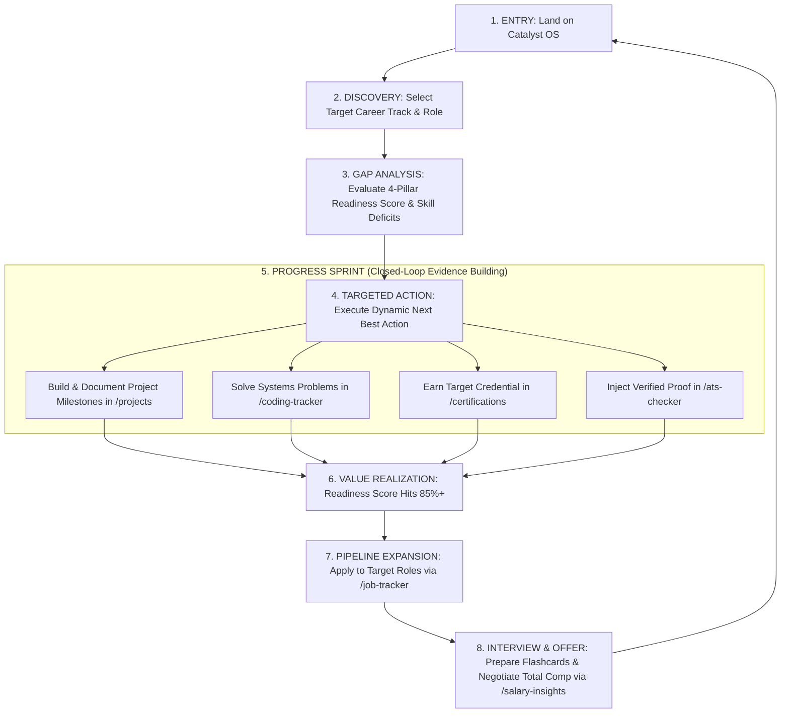

# 03. Primary User Journey & Lifecycle Flow Analysis

## 1. The Ideal Closed-Loop Career Journey

---

## 2. Journey Stage-by-Stage Friction & Opportunities

| Stage | Current Page | User Intent | Current Friction | Missing Guidance | Opportunity |
| :--- | :--- | :--- | :--- | :--- | :--- |
| **1. Entry** | `/` (Overview) | "What is my current career standing?" | Overwhelmed by 18 sidebar choices and 4 dense cards | No 1-sentence welcome banner explaining Demo Mode | Add an explicit "Choose a Candidate Persona to Explore" onboarding guide. |
| **2. Target Role** | `/skills` or `/` | "What skills does a Senior ML Engineer need?" | Target roles are selected via small dropdown on Overview | Skill dependencies are not visually graphed | Add an interactive Career Graph / Competency Tree visualization. |
| **3. Gap Analysis** | `/analytics` | "What is holding me back from passing Anthropic screens?" | Gaps are listed as raw numbers (e.g. `Delta: 20%`) | Doesn't explain which projects close the specific gap | Connect each skill gap directly to a recommended portfolio blueprint. |
| **4. Action** | `/projects` or `/ats-checker` | "How do I prove I know Triton/CUDA?" | Action requires manually navigating across 3 different pages | Next Best Action card on dashboard doesn't show an interactive progress checklist | Embed quick-action modals directly on the dashboard. |
| **5. Evidence** | `/projects` & `/github` | "Link my real code to my portfolio" | GitHub sync is a separate sub-page rather than an automatic project enhancer | Repositories don't automatically extract README badges | Auto-populate project evidence from connected GitHub repo topics. |
| **6. Realization** | `/` & `/portfolio` | "Showcase my verified readiness to recruiters" | Public portfolio URL is not prominently highlighted on dashboard | Recruiters might not realize candidate skills are mathematically verified | Add a "Share Verified Portfolio Link" button on top telemetry bar. |
| **7. Pipeline** | `/job-tracker` | "Track active interviews and deadlines" | Kanban board is disconnected from interview flashcard bank | Moving card to "Interview" stage doesn't auto-link company questions | Auto-filter `/interview-prep` questions when dragging an application to Interview. |
| **8. Negotiation**| `/salary-insights` | "Maximize offer leverage with competing data" | Comp modeler is an isolated calculator | Doesn't import current applied salaries from `/job-tracker` | Pre-fill competing offer numbers directly from the Kanban pipeline. |

---

## 3. Critical Drop-Off & Confusion Risk Points

1. **The Navigation Maze (Exploring Randomly)**:
   * Users click through 5+ unrelated pages without understanding that `/certifications`, `/coding-tracker`, and `/projects` feed directly into `/ats-checker` and `/analytics`.
2. **The "Passive Viewer" Drop-off**:
   * Visitors view the read-only numbers without realizing they can type, modify resume text, add applications, or trigger simulations.
3. **The Disconnected Interview Loop**:
   * Users who log an interview for Anthropic in `/job-tracker` miss the Anthropic question bank in `/interview-prep` because the system does not auto-link them.
