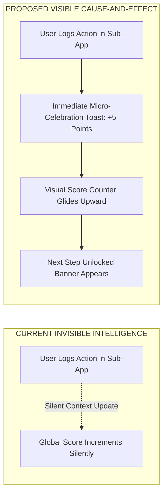

# 05. System Connectivity & Experience Intelligence Audit

## 1. Objective & Connectivity Framework

A core differentiator of Catalyst OS is its **interconnected career intelligence**. 

This audit evaluates whether data relationships are not just technically wired in code, but **visually communicated, intuitively understandable, and actionable** for the user.

---

## 2. System Relationship Evaluation Matrix

| System Relationship | Technically Connected? | Visually Communicated? | User Understandable? | Actionable Feedback Provided? | Audit Evaluation |
| :--- | :---: | :---: | :---: | :---: | :--- |
| **Certifications ➔ Readiness** | ✅ YES (`syncCertification`) | ⚠️ PARTIAL | ⚠️ PARTIAL | ❌ NO (No toast/badge explaining score increase) | **Invisible Intelligence**: User earns AWS MLS-C01, but the system doesn't display `"+5 pts to Pipeline Readiness"` on the page. |
| **Coding Problems ➔ Skills ➔ Readiness** | ✅ YES (`syncSolvedProblem`) | ⚠️ PARTIAL | ⚠️ PARTIAL | ❌ NO | **Subtle Effect**: Solving a problem upgrades skill to `VERIFIED`, but the user has to manually visit `/skills` to notice the badge change. |
| **Projects ➔ Evidence ➔ ATS Match** | ✅ YES (`injectATSProof`) | ✅ YES | ✅ YES | ✅ YES (Toast + green badge shown) | **Exemplary Connectivity**: User clicks `+ INJECT` in ATS Checker, sees `💡 Verified in Triton Gateway`, and resume updates immediately. |
| **arXiv Resources ➔ Learning ➔ Skills** | ✅ YES (`syncResource`) | ❌ NO | ❌ NO | ❌ NO | **Disconnected Perception**: Reading research papers feels like a separate bookmarks list rather than active study evidence. |
| **Job Applications ➔ Next Best Action** | ✅ YES (`generateNextBestAction`)| ✅ YES | ✅ YES | ✅ YES (Dynamic CTA links to `/interview-prep`) | **High Perceived Intelligence**: Moving a job to "Interview" stage immediately shifts dashboard Next Action to company prep. |
| **Readiness Score ➔ Gap Deficits** | ✅ YES (`calculateCareerReadiness`) | ✅ YES | ✅ YES | ⚠️ PARTIAL | **Good Clarity**: 4 subscores clearly sum to overall score, but gaps lack a 1-click "Fix This Gap" action. |
| **Candidate Persona ➔ Entire OS** | ✅ YES (Reactive `CareerContext`) | ✅ YES | ✅ YES | ✅ YES (Live recomputation across all pages) | **High Intelligence**: Switching persona completely recalibrates target role, KPIs, competencies, and recommended actions. |

---

## 3. Where Invisible Intelligence Must Become Visible

### 1. The "Cause-and-Effect" Toast
* **Proposed Enhancement**: When `syncCertification`, `syncSolvedProblem`, or `syncResource` is triggered, display an explicit system intelligence toast:
  * *"✨ Credential Verified: AWS Certified ML Specialty added +5% to your Pipeline Readiness Score!"*
  * *"⚡ Competency Mastered: PyTorch & CUDA upgraded to [VERIFIED CODEBASE] tier!"*

### 2. The 1-Click "Fix Gap" Bridge
* **Current State**: `/analytics` shows `PyTorch Internals (Delta: 15%)` as a plain data row.
* **Proposed Enhancement**: Add a direct action button: `[BUILD HOOPER TRITON PROJECT →]` or `[SOLVE FLASHATTENTION PROBLEM →]` next to every identified gap deficit.

### 3. Automatic Company Linkage
* **Current State**: `/job-tracker` has an Anthropic card, and `/interview-prep` has Anthropic questions, but they are isolated.
* **Proposed Enhancement**: Clicking the Anthropic job card should offer a quick action: *"View 12 Anthropic System Design Flashcards →"*.
