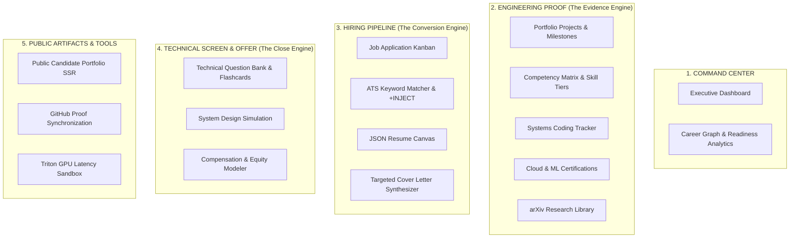

# 06. Information Architecture (IA) & Navigation Restructuring

## 1. Current Information Architecture Audit

### The Problem: "Feature Listing" vs. "User Journey"
The current sidebar lists 18 flat links in a single continuous column. It answers *"What pages exist in the code?"* instead of *"Where am I in my career journey?"*

```text
[CURRENT FLAT TAXONOMY — 18 Items]
  ├─ Overview
  ├─ Analytics
  ├─ Job Tracker
  ├─ Salary Insights
  ├─ Cover Letter
  ├─ ATS Checker
  ├─ Mock Interview
  ├─ Interview Prep
  ├─ Algorithm Sandbox
  ├─ Coding Tracker
  ├─ Skills
  ├─ Projects
  ├─ Project Generator
  ├─ Certifications
  ├─ Resources
  ├─ Resume Builder
  ├─ GitHub
  └─ Portfolio
```

---

## 2. Proposed Semantic Information Architecture

The proposed architecture organizes Catalyst OS into **4 Logical Career Phases** with clear category headers, visual badges, and progressive disclosure:



---

## 3. Structural Restructuring Matrix

| Current Route | Current Category | Proposed New Section | UX Justification |
| :--- | :--- | :--- | :--- |
| `/` | Top item | **COMMAND CENTER** | Central flight deck for all candidate metrics. |
| `/analytics` | Uncategorized | **COMMAND CENTER** | Directly supports the overview with gap modeling. |
| `/projects` | Middle | **ENGINEERING PROOF** | The primary anchor of engineering evidence. |
| `/skills` | Middle | **ENGINEERING PROOF** | Represents verified skills backed by projects. |
| `/coding-tracker` | Middle | **ENGINEERING PROOF** | Daily problem-solving proof. |
| `/certifications` | Lower | **ENGINEERING PROOF** | Formal accreditation evidence. |
| `/resources` | Lower | **ENGINEERING PROOF** | Deep learning paper reading mastery. |
| `/job-tracker` | Upper | **HIRING PIPELINE** | Core application lifecycle funnel. |
| `/ats-checker` | Upper | **HIRING PIPELINE** | First-line defense against resume screeners. |
| `/resume-builder` | Bottom | **HIRING PIPELINE** | Belongs directly alongside ATS Checker. |
| `/cover-letter` | Upper | **HIRING PIPELINE** | Contextual application asset. |
| `/interview-prep` | Middle | **INTERVIEW & CLOSE** | Technical revision for active rounds. |
| `/mock-interview` | Middle | **INTERVIEW & CLOSE** | Timed simulation for system design. |
| `/salary-insights`| Upper | **INTERVIEW & CLOSE** | Final offer negotiation and leverage. |
| `/portfolio/sharvin`| Bottom | **PUBLIC ARTIFACTS** | The external deliverable shown to recruiters. |
| `/github` | Bottom | **INTEGRATIONS** | Infrastructure proof sync. |
| `/algorithm-sandbox`| Middle | **TECHNICAL LABS** | Interactive visualizer embedded in projects. |

---

## 4. Mobile Navigation Simplification

On screens $\le 768\text{px}$, the sticky bottom bar should feature the **4 Critical Daily Pillars**:
1. **DASHBOARD** (`/`)
2. **EVIDENCE** (`/projects`)
3. **PIPELINE** (`/job-tracker`)
4. **ATS PROOF** (`/ats-checker`)
5. **MORE (Drawer)** (Contains all secondary and reference tools)
