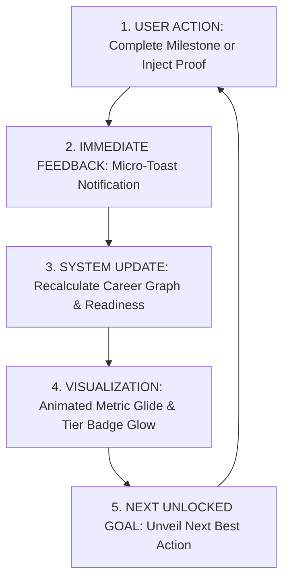

# 08. Progress Communication & Feedback Loop Design

## 1. Current Progress Representation Audit

Catalyst OS utilizes multiple quantitative progress indicators across its subsystems:

```text
[QUANTITATIVE PROGRESS TOKENS]
  ├─ Readiness Score: 0 - 100% (Composite Weighted Formula)
  ├─ Competency Level: 0 - 100% (Skill Target vs Current Level)
  ├─ Evidence Multiplier Tiers: CLAIM (0.35) ➔ ASSESSED (0.65) ➔ PROJECT (0.85) ➔ VERIFIED (1.0)
  ├─ ATS Alignment: 0 - 100% (JD Keyword Overlap)
  ├─ Project Milestones: Checkbox Completion (e.g. 2/3 Milestones Done)
  └─ Job Kanban: Stage Progression (Wishlist ➔ Applied ➔ Interview ➔ Offer)
```

---

## 2. Feedback Loop Gaps & Cause-and-Effect Disconnects

| User Action | Current Feedback | Missing Feedback Element | Emotional Impact |
| :--- | :--- | :--- | :--- |
| **Solving a CUDA Problem** | Problem marked as "Solved" in table | No notification that `PyTorch & CUDA` skill tier upgraded to `VERIFIED` | Local satisfaction, but missed realization of global career progress. |
| **Earning a Certification** | Row added to certifications table | No visual callout that +5% bonus was credited to Pipeline Readiness | Missed recognition of accreditation value. |
| **Injecting ATS Proof** | Keyword turns green in ATS checker canvas | Excellent local toast, but no notification of updated global ATS score | High local satisfaction, moderate global awareness. |
| **Advancing Job to "Offer"** | Card drops into Offer column | No celebratory prompt to open Salary Insights and negotiate total comp | Anti-climactic conclusion to an application sprint. |

---

## 3. The 5-Step Continuous Feedback Loop

To make Catalyst OS feel like a living, intelligent coach, every meaningful user action should trigger the **5-Step Continuous Feedback Loop**:



### Proposed Feedback Patterns
1. **The Milestone Achievement Glow**:
   * When all milestones in a project are checked off, the project card pulses with a subtle green border and unlocks the `VERIFIED CODEBASE` badge.
2. **The "Hiring Bar Cleared" Alert**:
   * When overall readiness crosses 80%, the header telemetry changes from `IN PROGRESS` to `🚀 READY FOR TOP-TIER INTERVIEWS`.
3. **Offer Celebration & Negotiation Prompt**:
   * Moving an application to the `OFFER` column in `/job-tracker` automatically triggers a modal:
     * *"🎉 Congratulations on your offer from Anthropic! Let's maximize your equity package using the Compensation Modeler →"*
