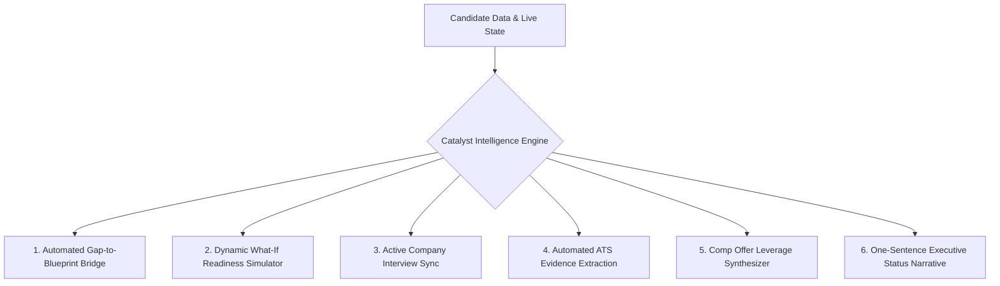

# 10. Experience Intelligence Opportunities & Coaching Mechanics

## 1. Grounded Intelligence vs. "AI Gimmicks"

Experience intelligence in Catalyst OS is **not** about adding generic chatbots. It is about building **deterministic, high-context coaching mechanics** that synthesize engineering achievements, hiring bars, and market data into actionable guidance.

---

## 2. Top 6 Experience Intelligence Opportunities

### 1. Automated Gap-to-Blueprint Bridge
* **Problem**: Candidate discovers they have a 20% deficit in `Distributed Systems`, but doesn't know what to build.
* **Intelligent Solution**: System maps the gap directly to the `Distributed MoE Parameter Sharding with NCCL` project template in `/project-generator` with a 1-click `[START THIS BLUEPRINT →]` button.

### 2. Interactive "What-If" Readiness Simulator
* **Problem**: Candidates wonder whether spending 20 hours on a certification is worth the effort vs building another project.
* **Intelligent Solution**: An interactive slider on `/analytics` that lets the candidate preview score changes:
  * *"Checking off your Triton project milestones will boost readiness by +11%, crossing the Anthropic screen threshold."*

### 3. Active Company Interview Synchronization
* **Problem**: Candidates apply to Anthropic, Cohere, and Databricks, but study generic LeetCode questions.
* **Intelligent Solution**: `/interview-prep` prioritizes questions tagged specifically with companies where the candidate has active applications in `interview` or `final` stages.

### 4. Automated ATS Evidence Extraction
* **Problem**: Candidates have rich project descriptions, but forget which projects demonstrate which keywords.
* **Intelligent Solution**: When pasting a new Job Description in `/ats-checker`, the engine automatically scans all project descriptions, milestones, and certs to auto-suggest:
  * *"Found 4 missing keywords in your JD that are already proven in your Triton FlashAttention project. [INJECT ALL 4 PROOFS (1-CLICK)]"*

### 5. Comp Offer Leverage Synthesizer
* **Problem**: Candidates feel nervous during negotiation and don't know how to articulate competing leverage.
* **Intelligent Solution**: `/salary-insights` ingests active competing offers from `/job-tracker` and generates an executive negotiation script with market percentile justifications.

### 6. One-Sentence Executive Status Narrative
* **Problem**: Raw numbers (63%, 4 certs, 2 projects) require mental synthesis.
* **Intelligent Solution**: Display an executive status summary atop the dashboard:
  * *"🎯 Status: 1 project milestone away from clearing Anthropic L5 hiring bar (Target: $210k–$270k)."*
