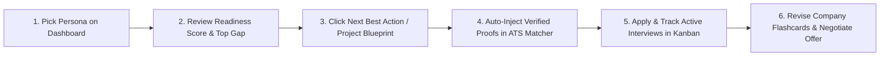

# 12. Phase 5 Executive Experience Summary & Product Vision

## 1. Executive Summary & Core Diagnosis

**Catalyst OS** has achieved exceptional technical foundation and domain depth. It possesses real mathematical rigor, authentic ML Systems benchmarks (Hopper H100 GPU specs, Triton fused kernels, FlashAttention-2 speedups), and a functioning closed-loop evidence engine.

However, from an **Experience & Product Coherence** standpoint:
> *Catalyst OS currently feels like an extraordinarily impressive collection of high-density engineering tools, rather than one seamlessly guided, step-by-step career operating system.*

---

## 2. Answers to Core Audit Inquiries

### 1. What Catalyst OS Currently Feels Like as a Product
* It feels like a **high-frequency engineering flight simulator / Bloomberg terminal for tech careers**. 
* The visual language is disciplined, clean, and authentic. The data is rich and realistic. 
* However, because the user is dropped directly into the cockpit with 18 unsegmented switches, it requires high cognitive effort to discover the intended primary workflow.

### 2. The Biggest Source of User Confusion
* **The "Portfolio vs. Tool" Identity Ambiguity & 18-Item Sidebar Choice Paralysis**:
  * New visitors cannot immediately tell whether they are exploring someone's personal website or using a career operating system.
  * The flat 18-link sidebar treats daily workflows (`/job-tracker`), deep technical labs (`/algorithm-sandbox`), and reference documents (`/resources`) with identical visual prominence.

### 3. The Strongest Existing Product Experience
* **The Closed-Loop ATS Proof Injection Engine (`/ats-checker`) & Mathematical Latency Visualizer (`/algorithm-sandbox`)**:
  * Clicking `+ INJECT` in the ATS Checker and watching missing JD keywords get backed by verified Triton project evidence is pure product magic. It instantly communicates why Catalyst OS is 10x more valuable than a plain PDF resume.

---

## 3. The 10 Highest-Impact Experience Improvements

| # | Improvement | Priority | Target Outcome |
| :- | :--- | :---: | :--- |
| **1** | **Interactive Onboarding Banner & Guided Tour** | **P0** | Eliminates first-30-second ambiguity; invites users to explore preloaded candidate personas. |
| **2** | **Semantic 4-Phase Information Architecture** | **P0** | Groups 18 flat links into: Command Center, Engineering Proof, Pipeline, and Technical Close. |
| **3** | **Clickable 4-Pillar Dashboard Deep Links** | **P0** | Turns passive dashboard cards into 1-click navigation shortcuts to `/skills`, `/projects`, `/ats-checker`, and `/job-tracker`. |
| **4** | **1-Click Gap-to-Blueprint Bridge** | **P1** | Connects identified skill deficits (e.g. Distributed Systems 20% gap) directly to actionable project templates. |
| **5** | **1-Click ATS "Inject All Verified Proofs"** | **P1** | Auto-scans candidate portfolio and injects all matching verified keywords in a single click. |
| **6** | **Active Company Interview Question Linkage** | **P1** | Automatically prioritizes company-specific flashcards in `/interview-prep` based on active applications in `/job-tracker`. |
| **7** | **Cause-and-Effect System Intelligence Toasts** | **P1** | Displays clear celebratory toasts when credentials or coding problems add points to global readiness. |
| **8** | **Interactive "What-If" Readiness Simulator** | **P2** | Allows candidates to toggle prospective milestone completions and preview future score increases. |
| **9** | **Offer Negotiation Auto-Import** | **P2** | Ingests active job offers from Kanban into the Compensation Modeler with 1 click. |
| **10** | **Embedded Triton Latency Visualizer in Project Card** | **P3** | Embeds the GPU benchmark directly inside the Hopper project card as tangible engineering proof. |

---

## 4. Recommended Future User Journey

---

## 5. Master Index of Phase 5 Audit Reports

All 12 detailed product experience and UX audit files are available in [`docs/phase-5-product-experience/`](file:///E:/career-catalyst/docs/phase-5-product-experience/):
1. [`docs/phase-5-product-experience/01-product-definition.md`](file:///E:/career-catalyst/docs/phase-5-product-experience/01-product-definition.md)
2. [`docs/phase-5-product-experience/02-first-time-user-experience.md`](file:///E:/career-catalyst/docs/phase-5-product-experience/02-first-time-user-experience.md)
3. [`docs/phase-5-product-experience/03-primary-user-journey.md`](file:///E:/career-catalyst/docs/phase-5-product-experience/03-primary-user-journey.md)
4. [`docs/phase-5-product-experience/04-feature-ecosystem-analysis.md`](file:///E:/career-catalyst/docs/phase-5-product-experience/04-feature-ecosystem-analysis.md)
5. [`docs/phase-5-product-experience/05-system-connectivity-audit.md`](file:///E:/career-catalyst/docs/phase-5-product-experience/05-system-connectivity-audit.md)
6. [`docs/phase-5-product-experience/06-information-architecture.md`](file:///E:/career-catalyst/docs/phase-5-product-experience/06-information-architecture.md)
7. [`docs/phase-5-product-experience/07-dashboard-experience.md`](file:///E:/career-catalyst/docs/phase-5-product-experience/07-dashboard-experience.md)
8. [`docs/phase-5-product-experience/08-progress-feedback-analysis.md`](file:///E:/career-catalyst/docs/phase-5-product-experience/08-progress-feedback-analysis.md)
9. [`docs/phase-5-product-experience/09-visual-hierarchy-analysis.md`](file:///E:/career-catalyst/docs/phase-5-product-experience/09-visual-hierarchy-analysis.md)
10. [`docs/phase-5-product-experience/10-product-intelligence-opportunities.md`](file:///E:/career-catalyst/docs/phase-5-product-experience/10-product-intelligence-opportunities.md)
11. [`docs/phase-5-product-experience/11-prioritized-experience-roadmap.md`](file:///E:/career-catalyst/docs/phase-5-product-experience/11-prioritized-experience-roadmap.md)
12. [`docs/phase-5-product-experience/12-phase-5-executive-summary.md`](file:///E:/career-catalyst/docs/phase-5-product-experience/12-phase-5-executive-summary.md)
