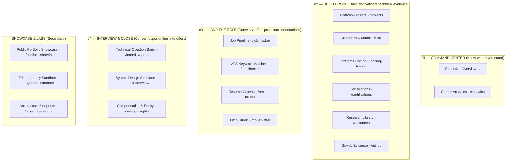

# 02. Semantic Four-Phase Navigation Architecture

## 1. Before vs. After Navigation Architecture

### Before: Unstructured Taxonomy
```text
INDEX
  ├─ Overview
  └─ Career Analytics
OPPORTUNITIES
  ├─ Pipeline & Kanban
  ├─ Salary Intelligence
  ├─ Cover Pitch Studio
  └─ ATS Scanner
TECHNICAL CORE
  ├─ Mock Assessment
  ├─ Question Bank
  ├─ Math Sandbox
  ├─ Coding Ledger
  └─ Skill Gap Map
PORTFOLIO & PROOF
  ├─ Case Studies
  ├─ System Blueprints
  ├─ Certifications
  ├─ Reading Index
  ├─ ATS Resume
  ├─ GitHub Sync
  └─ Public Portfolio
```

---

### After: Semantic Four-Phase Career Workflow



---

## 2. Navigation Item Mapping & Semantic Hierarchy

| Phase / Section | Route | Desktop Label | Mobile Label | Canonical Purpose |
| :--- | :--- | :--- | :--- | :--- |
| **01 — COMMAND CENTER** | `/` | Executive Overview | Overview | Daily flight deck, telemetry & KPIs |
| **01 — COMMAND CENTER** | `/analytics` | Career Analytics | Analytics | Multi-factor gap modeling & radar |
| **02 — BUILD PROOF** | `/projects` | Portfolio Projects | Projects | Hopper GPU benchmarks & milestones |
| **02 — BUILD PROOF** | `/skills` | Competency Matrix | Skills | Skill target levels & evidence tiers |
| **02 — BUILD PROOF** | `/coding-tracker` | Systems Coding | Coding | CUDA/Triton problem solutions |
| **02 — BUILD PROOF** | `/certifications` | Certifications | Certs | Cloud & ML credential roadmap |
| **02 — BUILD PROOF** | `/resources` | Research Library | Papers | arXiv Deep Learning paper index |
| **02 — BUILD PROOF** | `/github` | GitHub Evidence | GitHub | Repository proof synchronization |
| **03 — LAND THE ROLE** | `/job-tracker` | Job Pipeline | Pipeline | Kanban stages & company tracking |
| **03 — LAND THE ROLE** | `/ats-checker` | ATS Keyword Matcher | ATS Match | Resume vs JD proof injection (`+INJECT`) |
| **03 — LAND THE ROLE** | `/resume-builder` | Resume Canvas | Resume | JSON resume editing & PDF export |
| **03 — LAND THE ROLE** | `/cover-letter` | Pitch Studio | Cover Pitch | Targeted recruiter cover letters |
| **04 — INTERVIEW & CLOSE** | `/interview-prep` | Technical Question Bank | Questions | Company-specific flashcards |
| **04 — INTERVIEW & CLOSE** | `/mock-interview` | System Design Simulator| Mock Interview | Timed system design scenarios |
| **04 — INTERVIEW & CLOSE** | `/salary-insights` | Compensation & Equity | Compensation | 4-year equity modeling & leverage |
| **SHOWCASE & LABS** | `/portfolio/sharvin`| Public Portfolio Showcase | Public Showcase | External candidate profile SSR |
| **SHOWCASE & LABS** | `/algorithm-sandbox`| Triton Latency Sandbox | GPU Sandbox | Interactive batch/prompt visualizer |
| **SHOWCASE & LABS** | `/project-generator`| Architecture Blueprints | Blueprints | STAR architecture spec generator |
