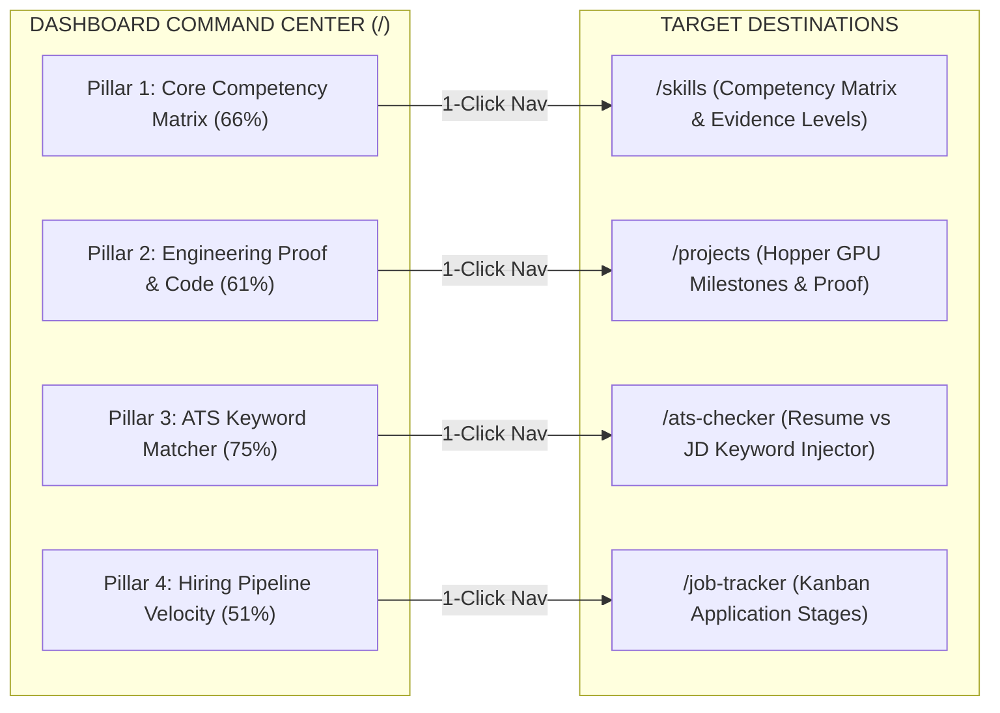

# 04. Dashboard Connectivity & Clickable Pillars

## 1. Transforming Passive Readouts into Interactive Navigational Gateways

The 4 Core Career Readiness Pillars on the Executive Dashboard (`/`) have been upgraded from static text metrics into **fully interactive, clickable navigation cards**.

---

## 2. Pillar Definition & Interactive Mapping Matrix

| Pillar Card | Phase Tag | Subscore Metric | Mathematical Weight | Target Destination | Interactive Affordances |
| :--- | :--- | :--- | :--- | :--- | :--- |
| **1. Core Competency Matrix** | `02 • PROOF` | `readiness.breakdown.skills.score` (66%) | 30% Weight | [`/skills`](file:///E:/career-catalyst/src/app/skills/page.js) | Hover lift (`-2px`), subtle border glow, arrow glide (`→`), progress bar fill. |
| **2. Engineering Proof & Code** | `02 • PROOF` | `readiness.breakdown.portfolio.score` (61%) | 30% Weight | [`/projects`](file:///E:/career-catalyst/src/app/projects/page.js) | Hover lift (`-2px`), subtle border glow, arrow glide (`→`), progress bar fill. |
| **3. ATS Keyword Matcher** | `03 • CONVERT` | `readiness.breakdown.resume.score` (75%) | 20% Weight | [`/ats-checker`](file:///E:/career-catalyst/src/app/ats-checker/page.js) | Hover lift (`-2px`), subtle border glow, arrow glide (`→`), progress bar fill. |
| **4. Hiring Pipeline Velocity** | `03 • CONVERT` | `readiness.breakdown.applications.score` (51%) | 20% Weight | [`/job-tracker`](file:///E:/career-catalyst/src/app/job-tracker/page.js) | Hover lift (`-2px`), subtle border glow, arrow glide (`→`), progress bar fill. |

---

## 3. Keyboard & Assistive Technology Affordances

* **Semantic Anchor Elements**: Built using native Next.js `<Link>` wrappers to ensure standard browser navigation, right-click "Open in new tab", and search engine indexability.
* **Accessible ARIA Descriptions**: Each card features an explicit `aria-label` announcing the card title, score percentage, subscore weight, and target destination (e.g. `aria-label="Core Competency Matrix: 66%, 30% WEIGHT. Click to navigate to /skills"`).
* **Keyboard Focus Visibility**: Supports `Tab` navigation with high-contrast `:focus-visible` 2px solid blue outlines.
