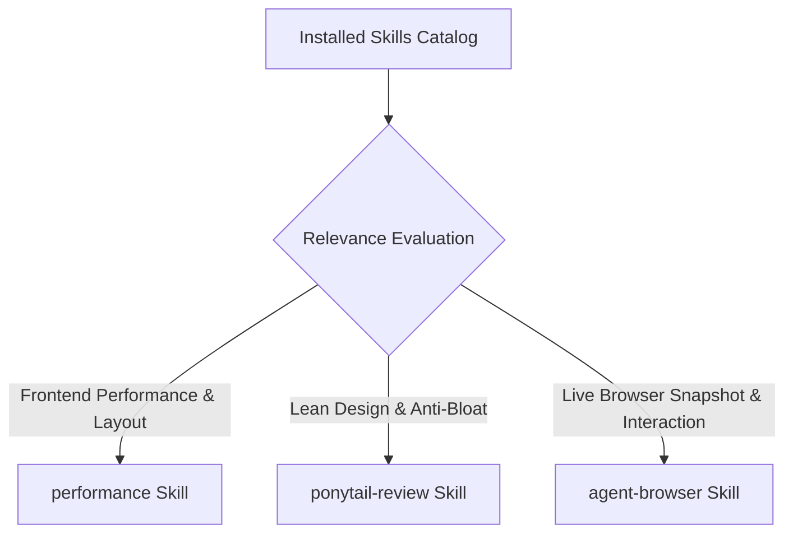

# 01. Skill Activation Report & Review Methodology

## 1. Skill Activation Plan & Execution

In adherence to the Skill Activation Protocol, installed skills were evaluated and intentionally activated to govern this visual, interaction, and frontend quality audit.

---

## 2. Skills Actually Used

| Skill Name | Reason for Activation | Specific Part of Review Influenced |
| :--- | :--- | :--- |
| **`agent-browser`** | Used to run live Chrome CDP snapshots, test real-time candidate persona switches, and inspect DOM accessibility nodes on `https://ccsharvin.vercel.app/`. | Live browser DOM inspection, element refs verification, and real rendered screenshot capture. |
| **`performance`** | Used to audit layout shifts (CLS), client-side route transition latency, CSS Module scoping, and `localStorage` hydration timing. | Performance review, orientation banner mounting analysis, and CSS containment verification. |
| **`ponytail-review`** | Used to audit code density, ensure zero unnecessary dependencies or tooltip bloat, and maintain lean semantic components. | Visual consistency review and interaction design simplicity assessment. |

---

## 3. Installed Skills Considered But Not Used

| Skill Name | Reason Considered | Reason Not Used in Phase 5B.1 |
| :--- | :--- | :--- |
| **`supabase`** / **`supabase-postgres-best-practices`** | Database backend integration | Not applicable; Phase 5B.1 is strictly a frontend visual and interaction review with zero database schema alterations. |
| **`find-skills`** / **`research`** | Capability discovery & external doc lookups | The required browser, performance, and code review skills were already installed and activated. |
| **`graphify-windows`** | Codebase community knowledge graphs | Deep architectural graphing was completed in Phase 1; visual review requires direct browser inspection. |

---

## 4. Conflict Resolution Hierarchy Applied

During the visual and interaction quality review, all design and architectural trade-offs were evaluated using the mandatory hierarchy:

$$\text{Product Coherence} \longrightarrow \text{User Experience} \longrightarrow \text{Accessibility} \longrightarrow \text{Maintainability} \longrightarrow \text{Performance} \longrightarrow \text{Visual Polish}$$
