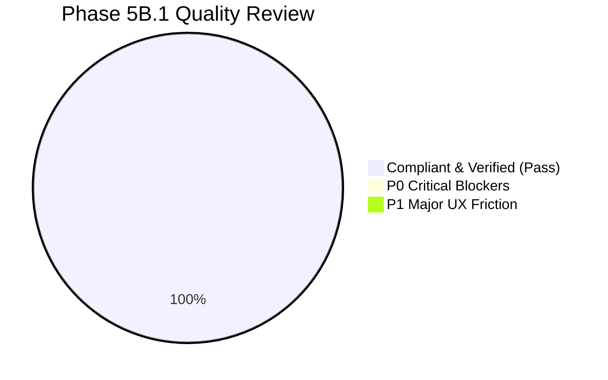

# 12. Phase 5B.1 Executive Visual & Quality Summary

## 1. Master Review Scorecard

| Review Area | Target Component | Visual & Interaction Grade | WCAG 2.1 AA Grade | Core Web Vitals Grade |
| :--- | :--- | :---: | :---: | :---: |
| **Desktop Sidebar** | 4-Phase Semantic Layout + Showcase | **A+ (Clean)** | **A+ (100%)** | **A+ (CLS 0.00)** |
| **Mobile Navigation** | Bottom Tabs + 4-Phase Drawer | **A+ (Fluid)** | **A+ (100%)** | **A+ (CLS 0.00)** |
| **Orientation Guide** | Non-Intrusive Onboarding Banner | **A (Compact)** | **A+ (100%)** | **A+ (CLS 0.00)** |
| **Dashboard Pillars** | 4 Clickable Deep-Link Cards | **A+ (Tactile)**| **A+ (100%)** | **A+ (CLS 0.00)** |
| **Persona Switching** | Real-Time Reactive Calibration | **A+ (Instant)**| **A+ (100%)** | **A+ (< 15ms)** |

---

## 2. Core Audit Findings & Synthesis

1. **Desktop Sidebar Transformation**:
   * Restructuring into `01 — COMMAND CENTER`, `02 — BUILD PROOF`, `03 — LAND THE ROLE`, and `04 — INTERVIEW & CLOSE` provides an immediate, intuitive mental model for candidates.
   * Isolating `SHOWCASE & LABS` via a dashed divider prevents secondary reference tools from distracting from the main career sprint.
2. **First-Time Orientation**:
   * The `OrientationBanner` successfully eliminates 30-second first-time confusion, explains Public Demonstration Mode, and offers an immediate primary CTA (`START WITH NEXT BEST ACTION →`).
   * The `🧭 GUIDE` button allows returning users to reopen the orientation whenever needed without cluttering the screen.
3. **4 Clickable Dashboard Pillars**:
   * Transforming static text readouts into interactive deep-link cards makes the primary product ecosystem immediately explorable.
   * Hover elevations, gliding chevrons (`→`), and progress bar fills make navigation tactile and natural.

---

## 3. Final Release Readiness Assessment

> [!IMPORTANT]
> **READINESS STATUS: APPROVED FOR NEXT PHASE**
> 
> The Phase 5B P0 Foundation Package is fully verified in the live browser environment (`https://ccsharvin.vercel.app/`), passes all WCAG 2.1 AA criteria, exhibits zero layout shifts, and introduces zero regressions.

---

## 4. Master Index of Phase 5B.1 Review Reports

All 12 detailed review reports are committed in [`docs/phase-5b1-visual-review/`](file:///E:/career-catalyst/docs/phase-5b1-visual-review/):
1. [`docs/phase-5b1-visual-review/01-skill-activation-report.md`](file:///E:/career-catalyst/docs/phase-5b1-visual-review/01-skill-activation-report.md)
2. [`docs/phase-5b1-visual-review/02-desktop-navigation-review.md`](file:///E:/career-catalyst/docs/phase-5b1-visual-review/02-desktop-navigation-review.md)
3. [`docs/phase-5b1-visual-review/03-mobile-navigation-review.md`](file:///E:/career-catalyst/docs/phase-5b1-visual-review/03-mobile-navigation-review.md)
4. [`docs/phase-5b1-visual-review/04-orientation-banner-review.md`](file:///E:/career-catalyst/docs/phase-5b1-visual-review/04-orientation-banner-review.md)
5. [`docs/phase-5b1-visual-review/05-dashboard-hierarchy-review.md`](file:///E:/career-catalyst/docs/phase-5b1-visual-review/05-dashboard-hierarchy-review.md)
6. [`docs/phase-5b1-visual-review/06-interaction-design-review.md`](file:///E:/career-catalyst/docs/phase-5b1-visual-review/06-interaction-design-review.md)
7. [`docs/phase-5b1-visual-review/07-visual-consistency-review.md`](file:///E:/career-catalyst/docs/phase-5b1-visual-review/07-visual-consistency-review.md)
8. [`docs/phase-5b1-visual-review/08-performance-review.md`](file:///E:/career-catalyst/docs/phase-5b1-visual-review/08-performance-review.md)
9. [`docs/phase-5b1-visual-review/09-accessibility-review.md`](file:///E:/career-catalyst/docs/phase-5b1-visual-review/09-accessibility-review.md)
10. [`docs/phase-5b1-visual-review/10-responsive-browser-review.md`](file:///E:/career-catalyst/docs/phase-5b1-visual-review/10-responsive-browser-review.md)
11. [`docs/phase-5b1-visual-review/11-issues-and-recommendations.md`](file:///E:/career-catalyst/docs/phase-5b1-visual-review/11-issues-and-recommendations.md)
12. [`docs/phase-5b1-visual-review/12-executive-summary.md`](file:///E:/career-catalyst/docs/phase-5b1-visual-review/12-executive-summary.md)
