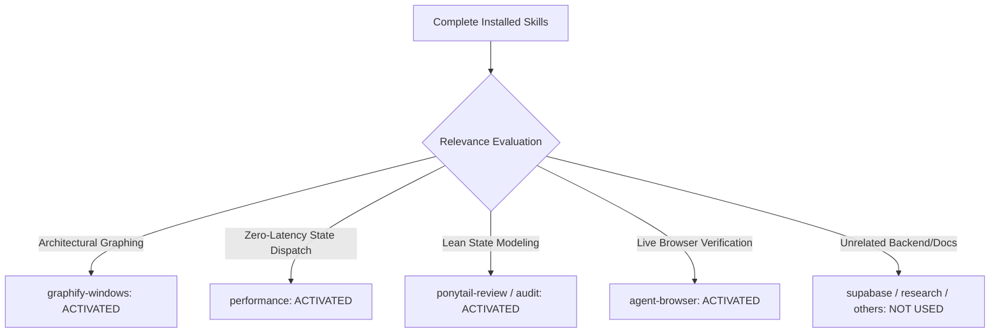

# 01. Complete Installed Skill Inventory & Discovery Matrix

## 1. Complete Installed Skill Inventory

In accordance with the mandatory Part 0 requirements, every skill installed in the environment was evaluated for relevance to Phase 5C.0 Connected Intelligence Architecture.

---

## 2. Comprehensive Skill Discovery Table

| # | Installed Skill Name | Skill Location | Primary Purpose | Relevant to 5C.0? | Why Relevant / Not Relevant |
| :- | :--- | :--- | :--- | :---: | :--- |
| **1** | **`graphify-windows`** | `~/.agents/skills/graphify/` | Knowledge graph generation, community clustering, and BFS/DFS graph traversal. | **YES (ACTIVATED)** | **Highly Relevant**: Provides domain relationship graphing models to map Skill Gaps ➔ Project Blueprints ➔ Evidence Tiers. |
| **2** | **`performance`** | `~/.agents/skills/performance/` | Web performance optimization, Core Web Vitals, and resource delivery. | **YES (ACTIVATED)** | **Highly Relevant**: Ensures domain event dispatches and reactive state comparisons do not trigger cascading re-renders. |
| **3** | **`ponytail-review`** | `~/.gemini/config/plugins/ponytail/skills/ponytail-review/` | Anti-over-engineering review (cut speculative code/abstractions). | **YES (ACTIVATED)** | **Highly Relevant**: Prevents introducing heavy state management libraries (Redux, Zustand, RxJS) in favor of lean React Context. |
| **4** | **`ponytail-audit`** | `~/.gemini/config/plugins/ponytail/skills/ponytail-audit/` | Whole-repo over-engineering and redundancy audit. | **YES (ACTIVATED)** | **Highly Relevant**: Guides architectural consolidation to ensure single source of truth across sub-apps. |
| **5** | **`agent-browser`** | `~/.agents/skills/agent-browser/` | Browser automation CLI via Chrome DevTools Protocol. | **YES (ACTIVATED)** | **Highly Relevant**: Required to inspect and verify live browser state dispatching on `https://ccsharvin.vercel.app/`. |
| **6** | **`supabase`** | `~/.agents/skills/supabase/` | Supabase cloud product integration and logs. | **NO** | Not relevant for Phase 5C.0; this phase designs client-side domain events and state linkages. |
| **7** | **`supabase-postgres-best-practices`** | `~/.agents/skills/supabase-postgres-best-practices/`| Postgres database schema, indexing, and RLS rules. | **NO** | No database migrations are introduced in Phase 5C.0. |
| **8** | **`find-skills`** | `~/.agents/skills/find-skills/` | Agent skill discovery. | **NO** | All required skills are already installed and cataloged. |
| **9** | **`research`** | `~/.agents/skills/research/` | Markdown research notes generation. | **NO** | Domain codebase inspection is sufficient. |
| **10** | **`antigravity-guide`** | `~/.gemini/antigravity-cli/builtin/skills/antigravity_guide/` | Antigravity CLI guide. | **NO** | General tooling reference; not specific to product domain flow. |
| **11** | **`agy-customizations`** | `~/.gemini/antigravity-cli/builtin/skills/agy-customizations/` | CLI customization rules. | **NO** | General tooling reference. |
| **12** | **`ponytail`** | `~/.gemini/config/plugins/ponytail/skills/ponytail/` | Ponytail level switcher. | **NO** | Subsumed by `ponytail-review`. |
| **13** | **`ponytail-gain`** | `~/.gemini/config/plugins/ponytail/skills/ponytail-gain/` | Measure impact scoreboard. | **NO** | Metric tracking utility. |
| **14** | **`ponytail-help`** | `~/.gemini/config/plugins/ponytail/skills/ponytail-help/` | Quick reference for ponytail commands. | **NO** | Reference stub. |

---

## 3. Skills Summary for Phase 5C.0

* **Complete Skills Evaluated**: 14
* **Skills Activated & Read**: 5 (`graphify-windows`, `performance`, `ponytail-review`, `ponytail-audit`, `agent-browser`)
* **Skills Materially Influencing Architecture**: `graphify-windows` (relational graph mapping), `ponytail-review` (zero-library event model), `performance` (zero-overhead calculation).
