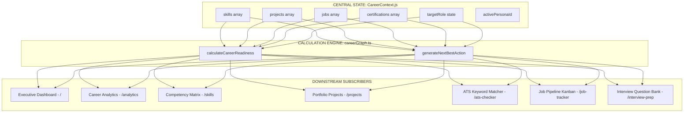

# 02. Current Domain Connectivity & Data Flow Map

## 1. Existing System Architecture & Data Pathways

This document traces all existing data flows across [`CareerContext.js`](file:///E:/career-catalyst/src/context/CareerContext.js), [`careerGraph.ts`](file:///E:/career-catalyst/src/lib/careerGraph.ts), and the 18 sub-applications.

---

## 2. Exhaustive Connection Inventory

| # | Source Event | State / Data Change | Calculation Triggered | Affected Features | User-Visible Result | Connectivity Nature |
| :- | :--- | :--- | :--- | :--- | :--- | :---: |
| **1** | **Persona Selected** | `selectPersona(id)` updates `skills`, `projects`, `jobs`, `userProfile` | Re-evaluates `calculateCareerReadiness` & `generateNextBestAction` | All 18 routes | Live score recalculates (e.g. 63% ➔ 78%), Next Best Action shifts target. | **Direct, Reactive** |
| **2** | **Certification Earned** | `syncCertification(cert)` appends `certifications` state | Bonus (+5 pts) added to `breakdown.applications.score` | Header, Sidebar, Dashboard, Analytics | Overall score increments by 1 point. | **Indirect, Currently Invisible** (No toast explaining +5 pts) |
| **3** | **Algorithm Solved** | `syncSolvedProblem(p)` updates matching skill level (+3%) | Increases `breakdown.skills.score`; sets evidence to `VERIFIED` | Skills, Dashboard, Analytics | Competency % rises; evidence badge turns green. | **Indirect, Silent** |
| **4** | **ATS Proof Injected** | `injectATSProof(keyword, proj)` sets skill evidence to `VERIFIED` | Upgrades evidence multiplier from `0.85` to `1.0` | ATS Checker, Resume, Skills | Keyword turns green with badge; ATS score updates. | **Direct, Clear Feedback** |
| **5** | **Job Stage Moved** | Drag-and-drop updates `j.status` in `jobs` state | Updates interview count multiplier in `breakdown.applications` | Pipeline score, Next Action | If moved to interview, Next Action prompts company prep. | **Indirect, No Context on Job Board** |
| **6** | **Skill Target Edited**| User adjusts target slider in `/skills` | Recomputes gap deficit array `readiness.gaps` | Analytics, Skills, Dashboard | Gap table updates delta %. | **Direct, Local** |

---

## 3. Disconnected & Invisible Intelligence Identified

1. **Skill Gap ➔ Blueprint Disconnect**: `readiness.gaps` computes deficits, but there is zero link to the 8 rich blueprints in `/project-generator`.
2. **Silent Readiness Impact**: When `syncCertification` or `syncSolvedProblem` executes, the global score increments, but the user is not told *what changed* or *why*.
3. **Application ➔ Interview Prep Disconnect**: Dragging Anthropic to "Interview" stage in `/job-tracker` does not provide an immediate prompt to open Anthropic flashcards in `/interview-prep`.
