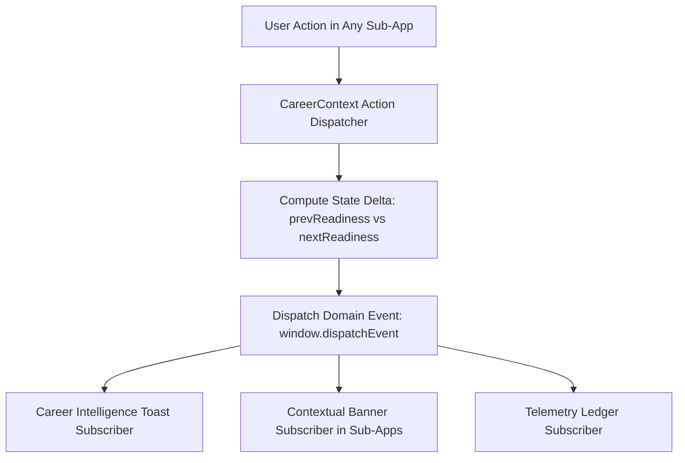

# 03. Lightweight Domain Event Architecture & Taxonomy

## 1. Zero-Library Event Architecture Rationale

In alignment with the `ponytail-review` skill (anti-over-engineering), we **do not** introduce external state management libraries (Redux Toolkit, Zustand, RxJS, EventEmitter polyfills).

Instead, the domain event model is implemented using **React Context Action Dispatchers** combined with standard browser **`CustomEvent`** channels:



---

## 2. Formal Domain Event Taxonomy

| Event Name | Source Trigger | Payload Structure | Primary Consumers | User-Visible Consequence |
| :--- | :--- | :--- | :--- | :--- |
| `CERTIFICATION_EARNED` | User completes certification in `/certifications` | `{ certId, name, issuer, previousScore, newScore, delta: +5, dimension: "Pipeline Readiness" }` | Toast, Analytics, Header | Micro-celebration toast explaining +5 pts to Pipeline Readiness. |
| `CODING_PROBLEM_SOLVED`| User solves algorithmic problem in `/coding-tracker` | `{ problemId, title, matchedSkill, previousLevel, newLevel, newTier: "VERIFIED" }` | Toast, Skills, Dashboard | Toast announcing skill mastery & tier upgrade to `VERIFIED CODEBASE`. |
| `SKILL_GAP_TARGETED` | User clicks "Build Blueprint" on deficit in `/analytics` | `{ skillName, gapDelta, recommendedBlueprintId, targetUrl }` | Project Generator, Router | Pre-fills blueprint generator with matching gap parameters. |
| `PROJECT_MILESTONE_DONE`| User checks milestone in `/projects` | `{ projectId, milestoneName, completedCount, totalCount, unlockedEvidence }` | Projects, Readiness, Toast | Project card glows green; unlocked evidence attaches to ATS matcher. |
| `ATS_PROOF_INJECTED` | User clicks `+ INJECT` in `/ats-checker` | `{ keyword, sourceProject, previousATSScore, newATSScore }` | Resume Canvas, ATS Toast | Keyword badge turns green (`💡 Verified`); resume auto-updates. |
| `APPLICATION_STAGE_CHANGED`| User drags card in `/job-tracker` | `{ jobId, company, role, previousStage, newStage, relevantQuestionCount }` | Job Tracker, Interview Prep | Card prompts: *"🎯 4 Anthropic flashcards ready in Interview Prep →"*. |
| `READINESS_CHANGED` | Dispatched whenever overall score shifts | `{ previousScore, newScore, delta, breakdownDelta, topFactor }` | Header Score, Live Ticker | Score counter animates with green pulse and delta indicator. |

---

## 3. Conceptual Event Dispatcher Architecture

```typescript
export interface DomainEventPayload<T = any> {
  eventType: string;
  timestamp: number;
  entityId?: string | number;
  entityName?: string;
  previousScore?: number;
  newScore?: number;
  delta?: number;
  affectedDimension?: string;
  reason?: string;
  metadata?: T;
}

export function dispatchDomainEvent<T>(eventType: string, payload: DomainEventPayload<T>) {
  if (typeof window !== 'undefined') {
    const event = new CustomEvent(`catalyst:${eventType.toLowerCase()}`, {
      detail: { ...payload, timestamp: Date.now() },
    });
    window.dispatchEvent(event);
  }
}
```
