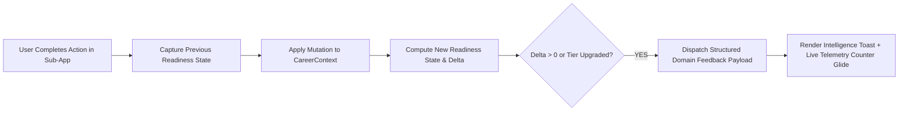

# 05. Connection B: Cause-and-Effect System Feedback Architecture

## 1. The Core Problem Solved

When candidates log credentials in [`/certifications`](file:///E:/career-catalyst/src/app/certifications/page.js), solve problems in [`/coding-tracker`](file:///E:/career-catalyst/src/app/coding-tracker/page.js), or check project milestones in [`/projects`](file:///E:/career-catalyst/src/app/projects/page.js), global readiness scores update silently. 

Candidates do not realize that their effort has concretely moved them closer to clearing technical interview bars.

Connection B creates an **explicit, mathematically authentic feedback loop** that explains *what changed*, *why it changed*, and *what goal was unlocked*.



---

## 2. Structured Domain Feedback Payload

```typescript
export interface CareerIntelligenceFeedback {
  actionType: 'CERTIFICATION_SYNC' | 'ALGORITHM_SOLVED' | 'ATS_PROOF_INJECTED' | 'MILESTONE_COMPLETED';
  entityName: string;
  affectedDimension: 'Core Competencies' | 'Portfolio Coverage' | 'ATS Alignment' | 'Pipeline Velocity';
  previousOverallScore: number;
  newOverallScore: number;
  overallDelta: number;
  previousSubscore: number;
  newSubscore: number;
  subscoreDelta: number;
  reason: string;
  unlockedMilestone?: string;
}
```

---

## 3. Mathematical State Comparison Engine

Instead of hardcoded fake animations, the feedback engine performs **true state delta evaluation** inside [`CareerContext.js`](file:///E:/career-catalyst/src/context/CareerContext.js):

```typescript
function evaluateStateDelta(prevData: CalculateReadinessParams, nextData: CalculateReadinessParams, entityName: string, actionType: string) {
  const prevResult = calculateCareerReadiness(prevData);
  const nextResult = calculateCareerReadiness(nextData);

  const overallDelta = nextResult.overallScore - prevResult.overallScore;
  
  // Identify which of the 4 subscores shifted
  let affectedDimension = 'Core Competencies';
  let subscoreDelta = 0;
  let previousSubscore = 0;
  let newSubscore = 0;

  if (nextResult.breakdown.applications.score !== prevResult.breakdown.applications.score) {
    affectedDimension = 'Pipeline Velocity';
    subscoreDelta = nextResult.breakdown.applications.score - prevResult.breakdown.applications.score;
    previousSubscore = prevResult.breakdown.applications.score;
    newSubscore = nextResult.breakdown.applications.score;
  } else if (nextResult.breakdown.skills.score !== prevResult.breakdown.skills.score) {
    affectedDimension = 'Core Competencies';
    subscoreDelta = nextResult.breakdown.skills.score - prevResult.breakdown.skills.score;
    previousSubscore = prevResult.breakdown.skills.score;
    newSubscore = nextResult.breakdown.skills.score;
  } else if (nextResult.breakdown.portfolio.score !== prevResult.breakdown.portfolio.score) {
    affectedDimension = 'Portfolio Coverage';
    subscoreDelta = nextResult.breakdown.portfolio.score - prevResult.breakdown.portfolio.score;
    previousSubscore = prevResult.breakdown.portfolio.score;
    newSubscore = nextResult.breakdown.portfolio.score;
  }

  return {
    actionType,
    entityName,
    affectedDimension,
    previousOverallScore: prevResult.overallScore,
    newOverallScore: nextResult.overallScore,
    overallDelta,
    previousSubscore,
    newSubscore,
    subscoreDelta,
    reason: `Verified ${actionType.toLowerCase().replace('_', ' ')} evidence credited to ${affectedDimension}`,
  };
}
```

---

## 4. Visual Feedback Presentation (Career Intelligence Toast)

The user receives a compact, non-blocking notification:

```text
+-------------------------------------------------------------------------------+
| ✨ CREDENTIAL VERIFIED: AWS Certified ML Specialty                            |
| +5% credited to Pipeline Velocity (Overall Readiness: 63% ➔ 64%)              |
| Reason: Verified cloud credential bonus applied. [VIEW ANALYTICS →]          |
+-------------------------------------------------------------------------------+
```
