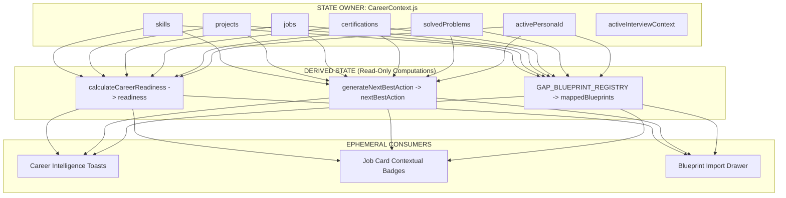

# 07. State Ownership, Persistence & Data Flow Matrix

## 1. Single Source of Truth Principles

To avoid state desynchronization, circular dependencies, and duplicate stores, all state is governed by strict ownership rules:

---

## 2. Comprehensive State Ownership Matrix

| State Entity | Source of Truth | State Owner | Event Trigger | Downstream Consumers | Persistence Mode | Demo Mode Fallback |
| :--- | :--- | :--- | :--- | :--- | :--- | :--- |
| **`skills`** | `CareerContext` | `CareerContext.js` | `syncSolvedProblem`, `injectATSProof` | Skills, Analytics, Readiness, ATS | `localStorage` / Supabase | `DEMO_PERSONAS[id].skills` |
| **`projects`** | `CareerContext` | `CareerContext.js` | `importBlueprint`, `completeMilestone` | Projects, Dashboard, Portfolio | `localStorage` / Supabase | `DEMO_PERSONAS[id].projects` |
| **`jobs`** | `CareerContext` | `CareerContext.js` | `updateJobStage`, `addJob` | Job Tracker, Interview Prep, Dashboard | `localStorage` / Supabase | `DEMO_PERSONAS[id].jobs` |
| **`certifications`** | `CareerContext` | `CareerContext.js` | `syncCertification` | Certifications, Readiness, Header | `localStorage` / Supabase | Default ML Certs |
| **`activePersonaId`**| `CareerContext` | `CareerContext.js` | `selectPersona(id)` | All 18 Subsystems | `localStorage` (`catalyst_persona_id`)| `'sharvin_ml'` |
| **`activeInterviewContext`**| `CareerContext` | `CareerContext.js` | `APPLICATION_STAGE_CHANGED` | Job Tracker, Interview Prep, Next Action| In-Memory / Ephemeral | Active Company in Job Pipeline |
| **`lastFeedbackEvent`**| `CareerContext` | `CareerContext.js` | Any readiness delta mutation | Toast Component, Live Ticker | In-Memory (Cleared on dismiss) | `null` |

---

## 3. Persona Switching & Hydration Invariants

1. **Deterministic Persona Reset**:
   * Calling `selectPersona(id)` immediately loads clean initial datasets for the selected persona from `DEMO_PERSONAS`.
   * Clears any active ephemeral feedback events to prevent cross-persona notification bleed.
2. **Offline / Demo Mode Robustness**:
   * If remote Supabase is offline or cold-starting, all state updates operate cleanly in-memory with `localStorage` persistence without throwing exceptions.
