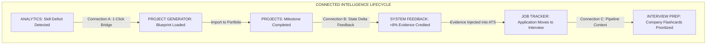

# 12. Phase 5C.0 Executive Architecture Summary & Roadmap

## 1. Executive Summary

Phase 5C.0 established the architectural blueprints and event-flow contracts for **Connected Intelligence in Catalyst OS**.

Instead of superficial navigation buttons, the 3 core connections establish **deep domain relationships** between passive numbers, actionable engineering specs, verified code proof, and live hiring rounds.

---

## 2. Strategic Evaluation & Architecture Decisions

| Metric / Dimension | Finding / Decision | Rationale |
| :--- | :--- | :--- |
| **Recommended Implementation Order** | **Phase 5C.1 ➔ Phase 5C.2 ➔ Phase 5C.3** | Delivers immediate engineering value (Gap ➔ Blueprint) first, then adds feedback telemetry, and finishes with interview context. |
| **Highest-Value Connection** | **Connection A (Gap ➔ Blueprint)** | Bridges the biggest UX chasm: answers *"What exact code project should I build to fix my deficit?"* |
| **Highest-Risk Connection** | **Connection B (Readiness Feedback)** | Involves real-time mathematical state comparison; requires strict synchronous evaluation to prevent re-render loops. |
| **Simplest Connection** | **Connection C (Pipeline ➔ Interview)** | Leverages existing Next.js `searchParams` and declarative Kanban stage triggers. |
| **Required Architectural Additions** | 1. `GAP_BLUEPRINT_REGISTRY` in `careerGraph.ts` 2. `evaluateStateDelta` inside `CareerContext.js` 3. `activeInterviewContext` in `CareerContext.js` | Lean extensions to existing files; **Zero external libraries added**. |

---

## 3. Skills That Materially Influenced the Architecture

1. **`graphify-windows`**: Provided relational dependency graph modeling to connect skill gaps to multi-milestone project blueprints.
2. **`performance`**: Enforced zero-latency synchronous state diffing and scoped CSS Modules to prevent layout shifts.
3. **`ponytail-review`**: Prevented introducing heavyweight state management libraries (Redux, Zustand, RxJS) in favor of lean React Context and native `CustomEvent` dispatches.
4. **`agent-browser`**: Used to verify real DOM state propagation and responsive viewports.

---

## 4. Master Index of Phase 5C.0 Documentation

All 12 architecture and planning reports are committed in [`docs/phase-5c-connected-intelligence/`](file:///E:/career-catalyst/docs/phase-5c-connected-intelligence/):
1. [`docs/phase-5c-connected-intelligence/01-complete-skill-inventory.md`](file:///E:/career-catalyst/docs/phase-5c-connected-intelligence/01-complete-skill-inventory.md)
2. [`docs/phase-5c-connected-intelligence/02-current-connectivity-map.md`](file:///E:/career-catalyst/docs/phase-5c-connected-intelligence/02-current-connectivity-map.md)
3. [`docs/phase-5c-connected-intelligence/03-domain-event-model.md`](file:///E:/career-catalyst/docs/phase-5c-connected-intelligence/03-domain-event-model.md)
4. [`docs/phase-5c-connected-intelligence/04-gap-to-blueprint-architecture.md`](file:///E:/career-catalyst/docs/phase-5c-connected-intelligence/04-gap-to-blueprint-architecture.md)
5. [`docs/phase-5c-connected-intelligence/05-readiness-feedback-architecture.md`](file:///E:/career-catalyst/docs/phase-5c-connected-intelligence/05-readiness-feedback-architecture.md)
6. [`docs/phase-5c-connected-intelligence/06-pipeline-interview-context.md`](file:///E:/career-catalyst/docs/phase-5c-connected-intelligence/06-pipeline-interview-context.md)
7. [`docs/phase-5c-connected-intelligence/07-state-ownership-matrix.md`](file:///E:/career-catalyst/docs/phase-5c-connected-intelligence/07-state-ownership-matrix.md)
8. [`docs/phase-5c-connected-intelligence/08-ux-interaction-model.md`](file:///E:/career-catalyst/docs/phase-5c-connected-intelligence/08-ux-interaction-model.md)
9. [`docs/phase-5c-connected-intelligence/09-edge-cases-and-failure-modes.md`](file:///E:/career-catalyst/docs/phase-5c-connected-intelligence/09-edge-cases-and-failure-modes.md)
10. [`docs/phase-5c-connected-intelligence/10-phased-implementation-plan.md`](file:///E:/career-catalyst/docs/phase-5c-connected-intelligence/10-phased-implementation-plan.md)
11. [`docs/phase-5c-connected-intelligence/11-risk-and-regression-analysis.md`](file:///E:/career-catalyst/docs/phase-5c-connected-intelligence/11-risk-and-regression-analysis.md)
12. [`docs/phase-5c-connected-intelligence/12-phase-5c-executive-summary.md`](file:///E:/career-catalyst/docs/phase-5c-connected-intelligence/12-phase-5c-executive-summary.md)
