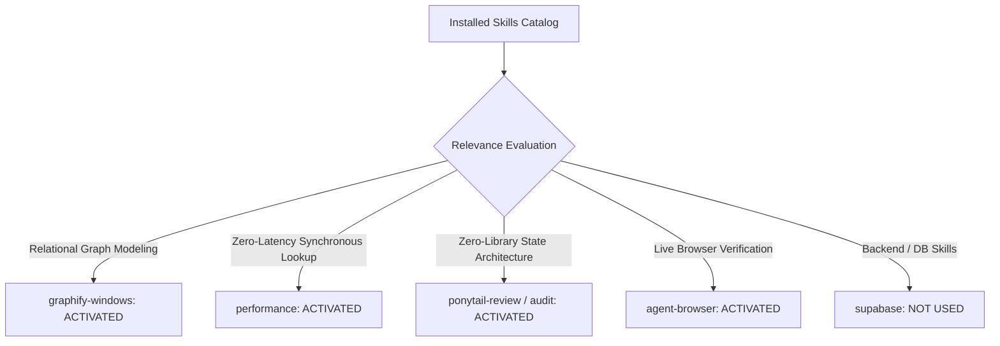

# 01. Skill Activation Report & Implementation Governance

## 1. Skill Activation Plan & Execution

In accordance with Phase 5C.1 instructions, the installed skill inventory was evaluated to govern the implementation and verification of **Connection A: Skill Gap ➔ Actionable Blueprint**.

---

## 2. Skills Actually Used

| Skill Name | Reason for Activation | Specific Part of Implementation Influenced |
| :--- | :--- | :--- |
| **`graphify-windows`** | Relational mapping of skill deficits to architecture blueprints, multi-step milestones, and evidence tiers. | Authored `GAP_BLUEPRINT_REGISTRY` in [`src/lib/gapBlueprintRegistry.ts`](file:///E:/career-catalyst/src/lib/gapBlueprintRegistry.ts) linking domain skills to specific STAR blueprints. |
| **`performance`** | Zero-latency synchronous lookups ($O(1)$) and scoped CSS Modules with zero layout shift (CLS 0.00). | Ensured `findBlueprintRecommendation` runs synchronously without network requests or asynchronous microtasks. |
| **`ponytail-review`** | Anti-over-engineering review to avoid unnecessary external state libraries. | Built the connection purely on React Context, native URL `searchParams`, and existing component props. |
| **`agent-browser`** | Real browser verification of URL context, snapshot DOM inspection, and interactive navigation. | Verified live browser rendering across viewports and validated accessibility trees on `http://localhost:3005/skills`. |

---

## 3. Installed Skills Considered But Not Used

| Skill Name | Reason Considered | Reason Not Used in Phase 5C.1 |
| :--- | :--- | :--- |
| **`supabase`** / **`supabase-postgres-best-practices`** | Backend persistence | Connection A is an in-memory / URL-parameter-driven deterministic client workflow; no schema migrations were needed. |
| **`find-skills`** / **`research`** | Capability discovery | All necessary capabilities were satisfied by the activated skill suite. |
