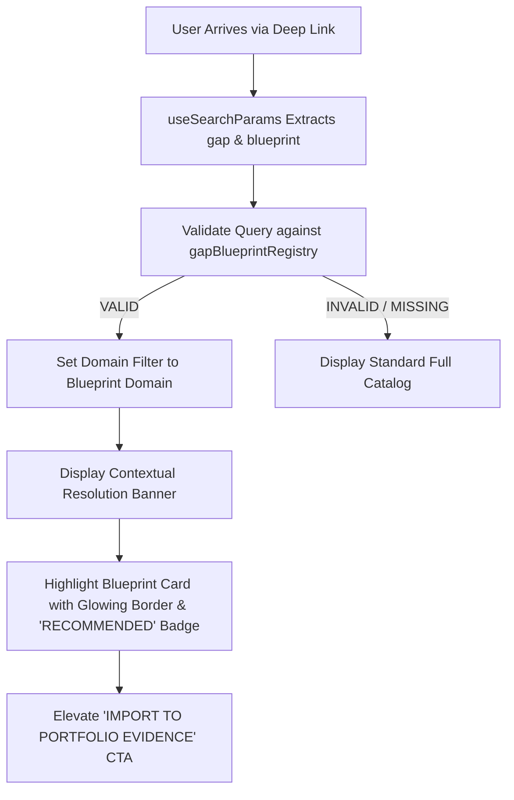

# 07. Project Generator Contextualization & Blueprint Preselection

## 1. Contextual Loading Mechanics

When a candidate arrives at [`/project-generator`](file:///E:/career-catalyst/src/app/project-generator/page.js) with valid query parameters:



---

## 2. Contextual UI Elements

### 1. Contextual Resolution Banner
```text
+---------------------------------------------------------------------------------------+
| 🎯 CONTEXTUAL GAP RESOLUTION BRIDGE                                 GAP: DISTRIBUTED SYSTEMS |
| Highlighted Multi-Node Tensor Parallel Inference Engine from Scratch because it       |
| directly addresses your Distributed Systems evidence gap.                             |
| Implements Megatron-LM tensor parallel linear layers, NCCL All-Reduce, and 1F1B.       |
+---------------------------------------------------------------------------------------+
```

### 2. Highlighted Blueprint Card Affordances
* **Border**: `2px solid var(--green)` with ambient glow (`box-shadow: 0 0 24px rgba(34, 197, 94, 0.15)`).
* **Badge**: Monospace pill reading `★ RECOMMENDED FOR YOUR GAP`.
* **CTA Button**: Emphasized as `btn-primary` (high contrast white) reading `+ IMPORT TO PORTFOLIO EVIDENCE`.

---

## 3. Freedom of Exploration Invariant
The user is never locked into the recommended blueprint. Domain tabs (`All Domains`, `Generative AI & LLMs`, `Computer Vision`, etc.) remain fully interactive.
