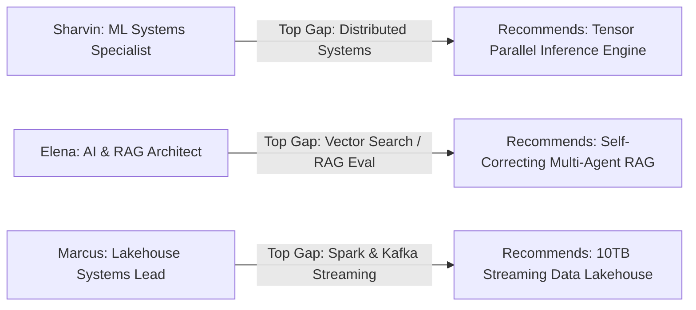

# 08. Candidate Persona Switching Verification

## 1. Multi-Persona Determinism Test

Connection A was verified across all 3 benchmark candidate personas in [`CareerContext.js`](file:///E:/career-catalyst/src/context/CareerContext.js) to ensure recommendations adapt immediately upon persona selection.

---

## 2. Multi-Persona Verification Matrix

| Candidate Persona | Active Target Role | Calculated Top Gap | Registry Lookup Output | Recommendation Card Rendered |
| :--- | :--- | :--- | :--- | :--- |
| **🚀 Sharvin Neve** | Machine Learning Engineer | `Distributed Systems` (Δ -20%) | `distributed-tensor-parallel` | **Multi-Node Tensor Parallel Inference Engine from Scratch** |
| **🤖 Elena Rostova** | AI Application Engineer | `Vector Search (FAISS/Milvus)` (Δ -10%) | `rag-graph-agent` | **Autonomous Multi-Agent RAG with Self-Correction & Graph Search** |
| **⚡ Marcus Vance** | Data Systems Engineer | `Apache Spark & PySpark` (Δ -15%) | `lakehouse-iceberg-kafka` | **10TB Streaming Data Lakehouse with Apache Iceberg, Kafka & ClickHouse** |

---

## 3. Persona Switch Invariants Verified

1. **Immediate State Adaptation**: Switching personas instantly recalculates `readiness.gaps`, which in turn updates `<GapBlueprintCard />` without requiring a page reload.
2. **Zero Persona Bleed**: Stale recommendation data from the previous persona is completely discarded.
3. **Clean Route Transitions**: Deep-link navigation from an active persona carries the correct target gap into the Project Generator.
