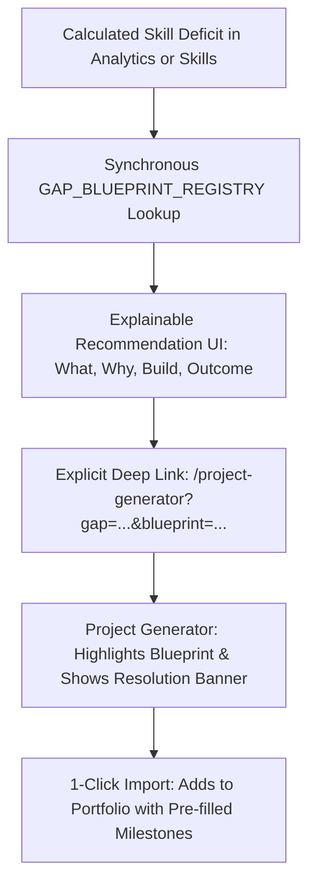

# 13. Phase 5C.1 Master Implementation Summary

## 1. Executive Summary

Phase 5C.1 successfully implemented **Connection A: Skill Gap ➔ Actionable Blueprint** in Catalyst OS.

This connection transforms candidate competency deficits from abstract deficit percentages into **actionable, production-ready engineering blueprints**.

---

## 2. Implemented Capabilities Inventory

| Component / File | Purpose | Key Behavior |
| :--- | :--- | :--- |
| [`src/lib/gapBlueprintRegistry.ts`](file:///E:/career-catalyst/src/lib/gapBlueprintRegistry.ts) | Centralized Registry | Deterministic $O(1)$ mapping linking skills to blueprints with rich explainability metadata. |
| [`src/components/GapBlueprintCard.js`](file:///E:/career-catalyst/src/components/GapBlueprintCard.js) | Explainable UI Component | Answers WHAT is weak, WHY it matters, WHAT to build, and WHAT will improve. |
| [`src/app/analytics/page.js`](file:///E:/career-catalyst/src/app/analytics/page.js) | Actionable Resolution Area | Automatically surfaces recommended blueprint for the candidate's top calculated gap. |
| [`src/app/skills/page.js`](file:///E:/career-catalyst/src/app/skills/page.js) | Skill Card Integration | Renders inline `[🚀 BLUEPRINT: ... →]` button on all skills with target deficits. |
| [`src/app/project-generator/page.js`](file:///E:/career-catalyst/src/app/project-generator/page.js)| Contextual Destination | Validates query parameters, displays contextual banner, and highlights recommended card. |
| [`src/app/api/project-generator/route.js`](file:///E:/career-catalyst/src/app/api/project-generator/route.js)| Blueprint Library API | Added Triton GPU, Multi-Node Distributed, and Streaming Lakehouse blueprints. |

---

## 3. Master Index of Phase 5C.1 Documentation

All 13 implementation and verification deliverables are committed in [`docs/phase-5c1-gap-blueprint/`](file:///E:/career-catalyst/docs/phase-5c1-gap-blueprint/):
1. [`docs/phase-5c1-gap-blueprint/01-skill-activation-report.md`](file:///E:/career-catalyst/docs/phase-5c1-gap-blueprint/01-skill-activation-report.md)
2. [`docs/phase-5c1-gap-blueprint/02-implementation-architecture.md`](file:///E:/career-catalyst/docs/phase-5c1-gap-blueprint/02-implementation-architecture.md)
3. [`docs/phase-5c1-gap-blueprint/03-gap-blueprint-registry.md`](file:///E:/career-catalyst/docs/phase-5c1-gap-blueprint/03-gap-blueprint-registry.md)
4. [`docs/phase-5c1-gap-blueprint/04-gap-detection-integration.md`](file:///E:/career-catalyst/docs/phase-5c1-gap-blueprint/04-gap-detection-integration.md)
5. [`docs/phase-5c1-gap-blueprint/05-recommendation-ui.md`](file:///E:/career-catalyst/docs/phase-5c1-gap-blueprint/05-recommendation-ui.md)
6. [`docs/phase-5c1-gap-blueprint/06-navigation-contract.md`](file:///E:/career-catalyst/docs/phase-5c1-gap-blueprint/06-navigation-contract.md)
7. [`docs/phase-5c1-gap-blueprint/07-project-generator-context.md`](file:///E:/career-catalyst/docs/phase-5c1-gap-blueprint/07-project-generator-context.md)
8. [`docs/phase-5c1-gap-blueprint/08-persona-switching-verification.md`](file:///E:/career-catalyst/docs/phase-5c1-gap-blueprint/08-persona-switching-verification.md)
9. [`docs/phase-5c1-gap-blueprint/09-accessibility-verification.md`](file:///E:/career-catalyst/docs/phase-5c1-gap-blueprint/09-accessibility-verification.md)
10. [`docs/phase-5c1-gap-blueprint/10-performance-verification.md`](file:///E:/career-catalyst/docs/phase-5c1-gap-blueprint/10-performance-verification.md)
11. [`docs/phase-5c1-gap-blueprint/11-edge-case-tests.md`](file:///E:/career-catalyst/docs/phase-5c1-gap-blueprint/11-edge-case-tests.md)
12. [`docs/phase-5c1-gap-blueprint/12-regression-and-build-results.md`](file:///E:/career-catalyst/docs/phase-5c1-gap-blueprint/12-regression-and-build-results.md)
13. [`docs/phase-5c1-gap-blueprint/13-phase-5c1-summary.md`](file:///E:/career-catalyst/docs/phase-5c1-gap-blueprint/13-phase-5c1-summary.md)
