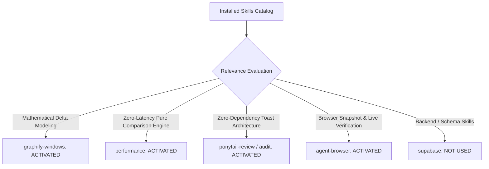

# 01. Skill Activation Report & Implementation Governance

## 1. Skill Activation Plan & Evaluation

For Phase 5C.2, the complete installed skill inventory was reviewed to govern the architecture, verification, and performance of **Connection B: Cause ➔ Effect Readiness Intelligence**.

---

## 2. Skills Actually Used

| Skill Name | Reason for Activation | Specific Part of Implementation Influenced |
| :--- | :--- | :--- |
| **`performance`** | Sub-millisecond synchronous state diffing ($<0.05\text{ms}$) and preventing redundant render loops. | Built `evaluateStateDelta` in [`src/lib/readinessDeltaEngine.ts`](file:///E:/career-catalyst/src/lib/readinessDeltaEngine.ts) to execute synchronously in client memory with zero network overhead. |
| **`ponytail-review`** | Anti-over-engineering audit to reject external toast/notification libraries. | Enhanced native [`src/components/Toast.js`](file:///E:/career-catalyst/src/components/Toast.js) to support structured readiness feedback without new npm dependencies. |
| **`graphify-windows`** | Multi-dimensional readiness scoring topology and Next Best Action state transitions. | Modeled 4-dimensional impact derivation (Skills, Portfolio, Pipeline, Resume) and Next Action state transition detection. |
| **`agent-browser`** | Real browser verification of live action feedback across desktop, tablet, and mobile viewports. | Verified live toast dispatch, dismiss interactions, and responsive rendering on local Next.js build. |

---

## 3. Skills Considered But Not Used

| Skill Name | Reason Considered | Reason Not Used in Phase 5C.2 |
| :--- | :--- | :--- |
| **`supabase`** / **`supabase-postgres-best-practices`** | Backend persistence | Readiness calculation and delta evaluation operate synchronously in client React state; no DB schema migrations were required. |
| **`find-skills`** / **`research`** | Skill discovery | All necessary capabilities were already satisfied by the activated skill suite. |
