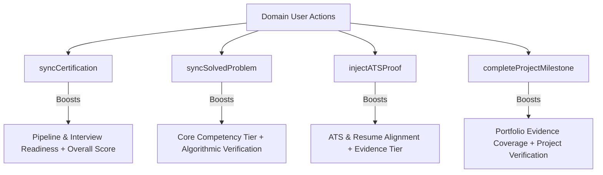

# 02. Audit of Readiness-Changing Domain Actions

## 1. Action Inventory & State Delta Audit

Every user interaction that mutates domain state was audited to determine its exact mathematical impact on candidate readiness dimensions.

---

## 2. Comprehensive Action Audit Table

| Action Name | Source Function | State Before | State After | Readiness Dimensions Affected | Next Best Action Impact |
| :--- | :--- | :--- | :--- | :--- | :--- |
| **Record / Sync Certification** | `syncCertification(cert)` in [`CareerContext.js`](file:///E:/career-catalyst/src/context/CareerContext.js#L110) | `certifications: prev` | `certifications: [cert, ...prev]` | **Pipeline & Interview Readiness** ($\uparrow 5\text{ pts}$ bonus per completed cert) | May transition Next Action if pipeline deficit was previously dominant. |
| **Solve Algorithmic Problem** | `syncSolvedProblem(problem)` in [`CareerContext.js`](file:///E:/career-catalyst/src/context/CareerContext.js#L124) | `assessments: prev`, `skills: prev` | `assessments: [problem, ...prev]`, matching skill level $+4\%$ & `VERIFIED` tier | **Core Competency Match** ($\uparrow 4\text{ pts}$ on matched domain skill) | Clears algorithmic skill gap; recalculates top priority gap. |
| **Inject ATS Keyword Proof** | `injectATSProof(skill, proj)` in [`CareerContext.js`](file:///E:/career-catalyst/src/context/CareerContext.js#L151) | `skills[i].evidence_level = CLAIM` | `skills[i].evidence_level = VERIFIED`, level $\ge 88\%$ | **ATS & Resume Alignment** + **Core Competency Match** | Upgrades evidence tier; closes ATS alignment deficit. |
| **Complete Project Milestone** | `completeProjectMilestone(id, name)` in [`CareerContext.js`](file:///E:/career-catalyst/src/context/CareerContext.js) | `projects[i].completed_milestones` | Milestone count $+1$; if $\ge 2$, status becomes `completed` & `VERIFIED` | **Portfolio Evidence Coverage** ($\uparrow 25\text{ pts}$ on portfolio dimension) | If first project completed, transitions Next Action from "Build First Project" to "Interview Prep". |

---

## 3. Zero-Change Action Suppression Rule
Actions that do not create a measurable domain state change (e.g. saving an identical profile field, clicking an already-active filter, or reading a duplicate resource) produce an overall delta of `0` and subscore delta of `0`, and are **suppressed** from generating score celebration toasts.
