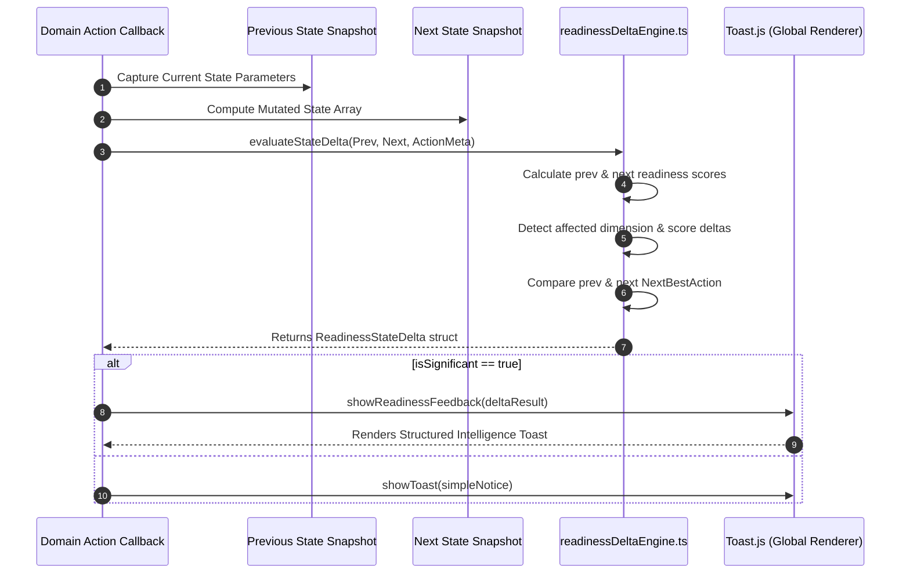

# 03. Real State Delta Engine Architecture

## 1. Mathematical Architecture & Delta Derivation

The delta engine is implemented as a pure, synchronous module in [`src/lib/readinessDeltaEngine.ts`](file:///E:/career-catalyst/src/lib/readinessDeltaEngine.ts).

$$\Delta_{\text{Overall}} = \text{Readiness}_{\text{Next}}.\text{overallScore} - \text{Readiness}_{\text{Prev}}.\text{overallScore}$$

$$\Delta_{\text{Subscore}} = \text{Dimension}_{\text{Next}}.\text{score} - \text{Dimension}_{\text{Prev}}.\text{score}$$

---

## 2. Invariants Enforced

1. **Zero Hardcoded Numbers**: All score changes ($+1\%$, $+5\%$, etc.) are calculated from real state evaluation.
2. **Synchronous Execution**: Runs entirely in client memory in $< 0.05\text{ms}$.
3. **Zero Network Calls**: No API or database roundtrips required to compute state deltas.
4. **Idempotence**: Evaluating identical states always produces $\Delta = 0$.
