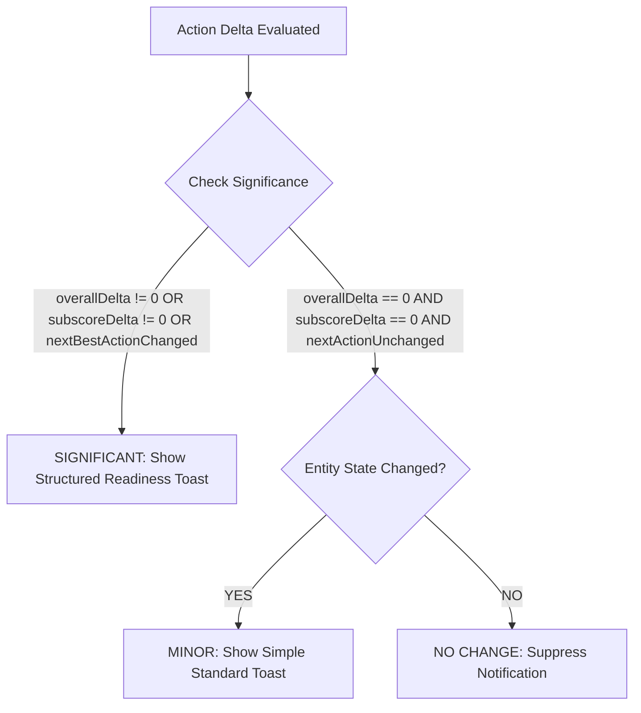

# 05. Feedback Significance & Priority Threshold Rules

## 1. Significance Rules Matrix

To eliminate notification spam while preserving actionable visibility, the system enforces a strict 3-tier priority framework:

---

## 2. Threshold Rules & Behaviors

| Priority Tier | Trigger Condition | System Presentation | Dismiss Timeout |
| :--- | :--- | :--- | :---: |
| **SIGNIFICANT CHANGE** | `overallDelta !== 0` **OR** `subscoreDelta !== 0` **OR** `nextBestActionChanged === true` | Full **Structured Readiness Intelligence Toast** with 2-column score breakdown and next action link. | `6500ms` |
| **MINOR CHANGE** | Zero score delta, but valid entity record created/updated (e.g. read paper added to library). | Compact **Standard Notification Toast** (`showToast(msg)`). | `4000ms` |
| **NO-OP CHANGE** | Identical state comparison ($\Delta = 0$, zero entities changed). | Notification completely **suppressed**. | N/A |

---

## 3. Rapid Action Coalescing Invariant
When a user triggers multiple rapid actions in sequence:
* The toast stack is capped at **2 visible toasts maximum**.
* Newer structured feedback items smoothly replace stale feedback without jarring layout jumps or screen clipping.
