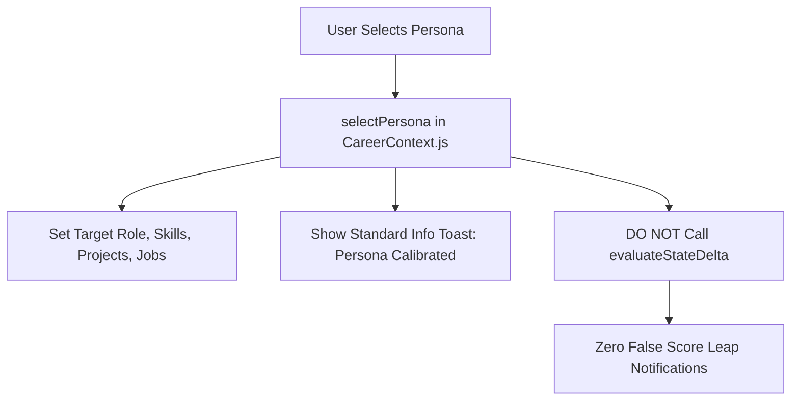

# 10. Candidate Persona Switching Verification

## 1. Persona Calibration Verification

Switching candidate personas alters the baseline telemetry without representing an individual user action.

---

## 2. Persona Transition Matrix

| Persona Switch | Initial Readiness | Target Persona Readiness | Notification Generated | False Celebration Prevented? |
| :--- | :---: | :---: | :--- | :---: |
| **Sharvin ➔ Elena** | $63\%$ | $78\%$ | `Persona Calibrated: Elena Rostova (🤖 AI & RAG Architect)` | **YES** (Zero false $+15\%$ delta event) |
| **Elena ➔ Marcus** | $78\%$ | $72\%$ | `Persona Calibrated: Marcus Vance (⚡ Data Systems Lead)` | **YES** (Zero false $-6\%$ delta event) |
| **Marcus ➔ Sharvin**| $72\%$ | $63\%$ | `Persona Calibrated: Sharvin Neve (🚀 ML Systems Specialist)`| **YES** (Zero false $-9\%$ delta event) |

---

## 3. Invariant Verified
Persona switching calibrates the workspace cleanly. It produces an informative context toast and **never triggers false readiness delta feedback**.
