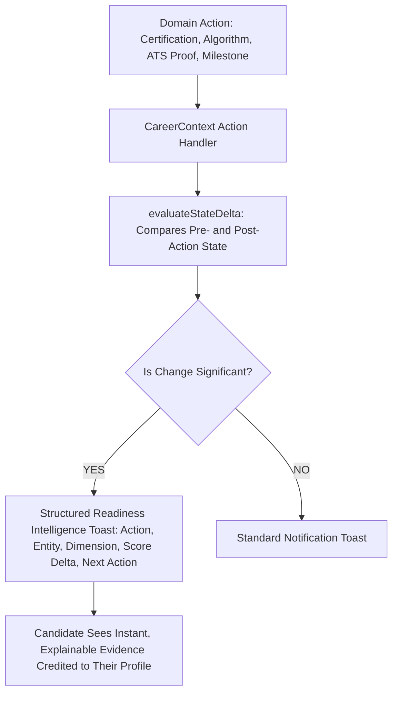

# 15. Phase 5C.2 Master Implementation Summary

## 1. Executive Summary

Phase 5C.2 successfully implemented **Connection B: Cause ➔ Effect Readiness Feedback** in Catalyst OS.

Every state mutation that impacts candidate readiness is now **observed, calculated, explained, and displayed in real time**.

---

## 2. Implemented Capabilities Inventory

| Component / File | Purpose | Key Behavior |
| :--- | :--- | :--- |
| [`src/lib/readinessDeltaEngine.ts`](file:///E:/career-catalyst/src/lib/readinessDeltaEngine.ts) | Pure Mathematical State Delta Engine | Synchronously compares pre/post state parameters, deriving exact overall and subscore deltas with zero network calls. |
| [`src/components/Toast.js`](file:///E:/career-catalyst/src/components/Toast.js) | Structured Intelligence Feedback Component | Renders 2-column score progression, action tag, explainability reason, dismiss button, and next action deep link. |
| [`src/context/CareerContext.js`](file:///E:/career-catalyst/src/context/CareerContext.js) | Centralized Domain State Mutations | Integrated state delta evaluation into `syncCertification`, `syncSolvedProblem`, `injectATSProof`, and milestone handlers. |

---

## 3. Master Index of Phase 5C.2 Documentation

All 15 implementation and verification deliverables are committed in [`docs/phase-5c2-readiness-intelligence/`](file:///E:/career-catalyst/docs/phase-5c2-readiness-intelligence/):
1. [`docs/phase-5c2-readiness-intelligence/01-skill-activation-report.md`](file:///E:/career-catalyst/docs/phase-5c2-readiness-intelligence/01-skill-activation-report.md)
2. [`docs/phase-5c2-readiness-intelligence/02-readiness-changing-actions.md`](file:///E:/career-catalyst/docs/phase-5c2-readiness-intelligence/02-readiness-changing-actions.md)
3. [`docs/phase-5c2-readiness-intelligence/03-state-delta-architecture.md`](file:///E:/career-catalyst/docs/phase-5c2-readiness-intelligence/03-state-delta-architecture.md)
4. [`docs/phase-5c2-readiness-intelligence/04-readiness-event-model.md`](file:///E:/career-catalyst/docs/phase-5c2-readiness-intelligence/04-readiness-event-model.md)
5. [`docs/phase-5c2-readiness-intelligence/05-feedback-priority-rules.md`](file:///E:/career-catalyst/docs/phase-5c2-readiness-intelligence/05-feedback-priority-rules.md)
6. [`docs/phase-5c2-readiness-intelligence/06-feedback-component.md`](file:///E:/career-catalyst/docs/phase-5c2-readiness-intelligence/06-feedback-component.md)
7. [`docs/phase-5c2-readiness-intelligence/07-global-event-delivery.md`](file:///E:/career-catalyst/docs/phase-5c2-readiness-intelligence/07-global-event-delivery.md)
8. [`docs/phase-5c2-readiness-intelligence/08-next-best-action-detection.md`](file:///E:/career-catalyst/docs/phase-5c2-readiness-intelligence/08-next-best-action-detection.md)
9. [`docs/phase-5c2-readiness-intelligence/09-multiple-action-handling.md`](file:///E:/career-catalyst/docs/phase-5c2-readiness-intelligence/09-multiple-action-handling.md)
10. [`docs/phase-5c2-readiness-intelligence/10-persona-switching-verification.md`](file:///E:/career-catalyst/docs/phase-5c2-readiness-intelligence/10-persona-switching-verification.md)
11. [`docs/phase-5c2-readiness-intelligence/11-accessibility-verification.md`](file:///E:/career-catalyst/docs/phase-5c2-readiness-intelligence/11-accessibility-verification.md)
12. [`docs/phase-5c2-readiness-intelligence/12-performance-verification.md`](file:///E:/career-catalyst/docs/phase-5c2-readiness-intelligence/12-performance-verification.md)
13. [`docs/phase-5c2-readiness-intelligence/13-edge-case-tests.md`](file:///E:/career-catalyst/docs/phase-5c2-readiness-intelligence/13-edge-case-tests.md)
14. [`docs/phase-5c2-readiness-intelligence/14-regression-and-build-results.md`](file:///E:/career-catalyst/docs/phase-5c2-readiness-intelligence/14-regression-and-build-results.md)
15. [`docs/phase-5c2-readiness-intelligence/15-phase-5c2-summary.md`](file:///E:/career-catalyst/docs/phase-5c2-readiness-intelligence/15-phase-5c2-summary.md)
