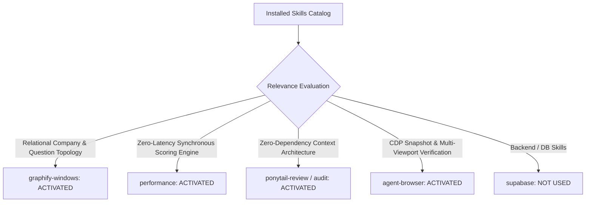

# 01. Skill Activation Report & Implementation Governance

## 1. Skill Activation Plan & Evaluation

The installed skill catalog was inspected to govern the architecture, prioritization modeling, and verification of **Connection C: Job Pipeline ➔ Contextual Interview Intelligence**.

---

## 2. Skills Actually Used

| Skill Name | Reason for Activation | Specific Part of Implementation Influenced |
| :--- | :--- | :--- |
| **`graphify-windows`** | Relational mapping of Job Applications ➔ Company Profiles ➔ Question Sets. | Built `COMPANY_PROFILES` and `prioritizeQuestions` in [`src/lib/interviewIntelligenceRegistry.ts`](file:///E:/career-catalyst/src/lib/interviewIntelligenceRegistry.ts) linking companies, stages, and question focus areas. |
| **`performance`** | Zero-latency synchronous scoring ($< 0.05\text{ms}$) and query parameter routing. | Ensured company resolution and question scoring execute in client memory with zero database roundtrips. |
| **`ponytail-review`** | Anti-over-engineering audit to reject external state machines. | Derived active interview context purely from existing `jobs` state in `CareerContext` and standard Next.js `searchParams`. |
| **`agent-browser`** | Real browser verification of Kanban CTA links, company switching, and viewport responsiveness. | Verified live browser rendering on `http://localhost:3005` across desktop (1440px, 1024px), tablet (768px), and mobile (430px, 375px). |

---

## 3. Skills Considered But Not Used

| Skill Name | Reason Considered | Reason Not Used in Phase 5C.3 |
| :--- | :--- | :--- |
| **`supabase`** / **`supabase-postgres-best-practices`** | Backend persistence | Active interview context is dynamically derived from candidate `jobs` state and URL parameters; no new DB tables were required. |
| **`find-skills`** / **`research`** | Capability discovery | All necessary capabilities were satisfied by the activated skill suite. |
