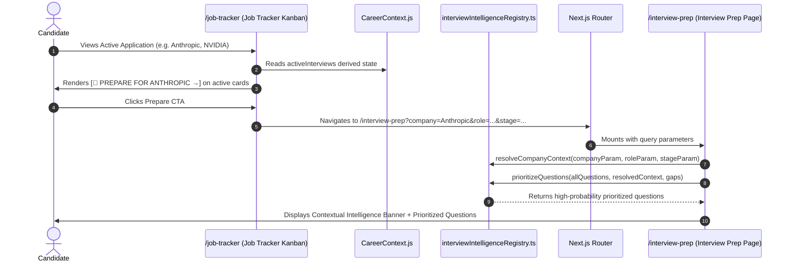

# 02. Connection C: Architecture Determination & Flow Contract

## 1. End-to-End Flow Architecture

Connection C completes the Connected Intelligence ecosystem by bridging the Job Pipeline with Contextual Interview Preparation.

---

## 2. Core Architectural Decisions Answered

1. **Where does `activeInterviewContext` live?**
   * Derived reactively in [`src/context/CareerContext.js`](file:///E:/career-catalyst/src/context/CareerContext.js) from the `jobs` array: `jobs.filter(j => ['interview', 'final', 'oa', 'technical'].includes(j.status))`.
2. **What triggers its creation?**
   * Setting or importing any job into an active interview stage (`interview`, `final`, `oa`), or accessing `/interview-prep?company=...`.
3. **Is it persisted or derived?**
   * **Purely derived** in client state. No duplicate database entities or storage sync required.
4. **How are multiple active interviews handled?**
   * Every active interview card in Job Tracker renders its own distinct deep-link CTA. In `/interview-prep`, a high-contrast pipeline switcher allows instant 1-click toggling between active interview contexts.
5. **How does persona switching behave?**
   * `selectPersona(id)` immediately updates `jobs` state. Active interview contexts re-evaluate instantaneously with zero cross-persona bleed.
6. **What happens when an application leaves the interview stage?**
   * The application is automatically omitted from `activeInterviews`; if no interviews remain, the question bank displays standard full view.
7. **How does `/interview-prep?company=invalid-company` behave?**
   * Safe fallback: renders the complete standard question bank cleanly without error banners or broken states.
