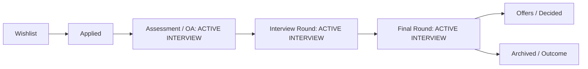

# 03. Application Stage Detection & Interview State Matrix

## 1. Stage Detection Topology

The application pipeline recognizes 7 distinct lifecycle stages:



---

## 2. Stage Classification Matrix

| Stage Key | Display Label | Stage Dot Class | Active Interview Trigger? | Rationale |
| :--- | :--- | :--- | :---: | :--- |
| `wishlist` | Wishlist | `status-dot-gray` | **NO** | Passive interest; no recruiter or technical screen scheduled. |
| `applied` | Applied | `status-dot-blue` | **NO** | Initial submission; awaiting employer response. |
| `oa` | Assessment / OA | `status-dot-amber` | **YES** | Online assessment / technical screening problem active. |
| `interview`| Interview Round | `status-dot-purple` | **YES** | Live technical screen or ML systems design round active. |
| `final` | Final Round | `status-dot-orange` | **YES** | Onsite / virtual onsite architectural & partner panel active. |
| `offer` | Offers / Decided | `status-dot-green` | **NO** | Evaluation complete; compensation and equity stage. |
| `rejected` | Archived / Outcome | `status-dot-red` | **NO** | Concluded; triggers Rejection Feedback & Gap Capture loop. |

---

## 3. Derivation Code Implementation

```typescript
const activeInterviews = (jobs || []).filter((j) =>
  ['interview', 'final', 'oa', 'technical'].includes(j.status)
);
```
