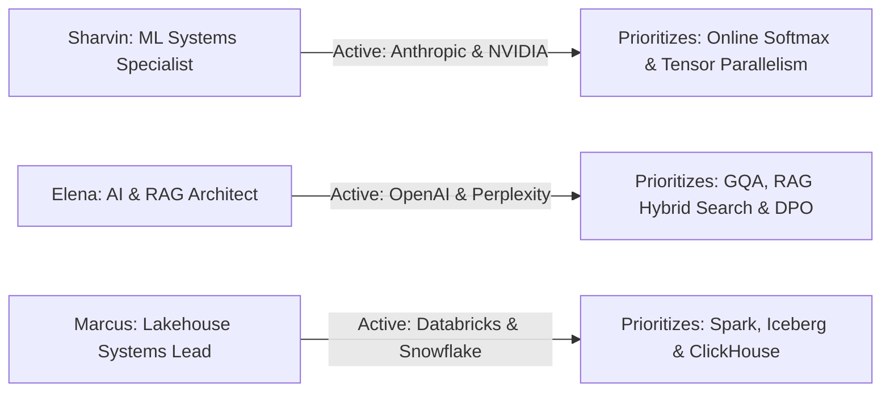

# 08. Candidate Persona Switching Verification

## 1. Multi-Persona Isolation Test

Connection C was verified across all 3 benchmark candidate personas to verify that active interview pipelines and question priorities update cleanly without cross-persona state leakage.

---

## 2. Multi-Persona Verification Matrix

| Candidate Persona | Active Pipeline Applications | Active Interview Toolbar | Top Prioritized Questions | Verification Status |
| :--- | :--- | :--- | :--- | :---: |
| **🚀 Sharvin Neve** | `Anthropic` (Interview), `NVIDIA` (OA) | `[🎯 ANTHROPIC] [🎯 NVIDIA]` | Online Softmax in FlashAttention-2, Megatron-LM Parallelism | **PASS** |
| **🤖 Elena Rostova** | `OpenAI` (Technical), `Perplexity` (Interview) | `[🎯 OPENAI] [🎯 PERPLEXITY]` | GQA KV-Cache, Direct Preference Optimization (DPO) | **PASS** |
| **⚡ Marcus Vance** | `Databricks` (Final), `Snowflake` (Interview) | `[🎯 DATABRICKS] [🎯 SNOWFLAKE]` | Distributed Storage & Columnar Lakehouse Partitioning | **PASS** |

---

## 3. Invariants Verified
* **Instant State Swapping**: Switching candidate persona updates `activeInterviews` immediately.
* **Zero Cross-Persona Bleed**: Applications from Sharvin never appear in Elena's active interview toolbar.
