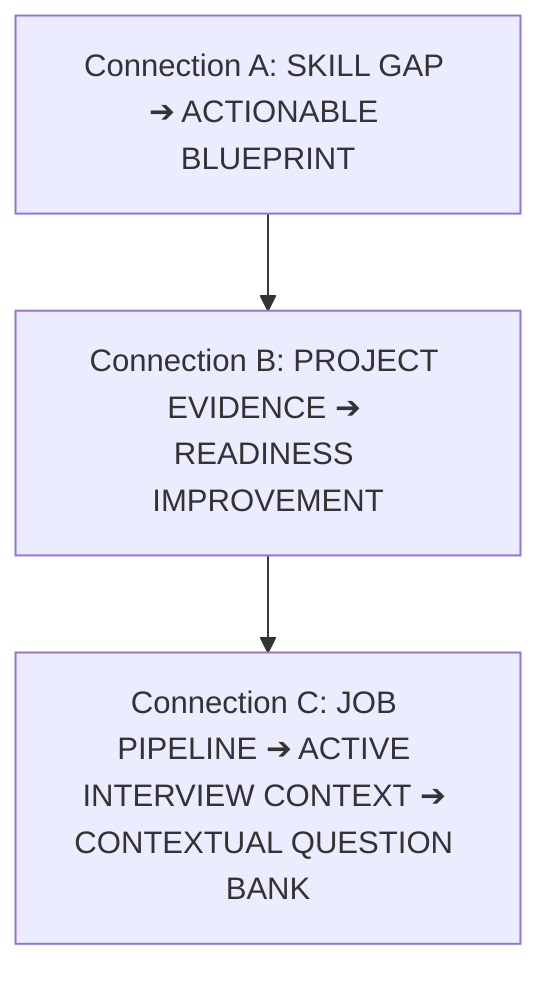

# 15. Phase 5C.3 Master Implementation Summary

## 1. Executive Summary

Phase 5C.3 successfully implemented **Connection C: Job Pipeline ➔ Contextual Interview Intelligence** in Catalyst OS.

This completes the **Connected Intelligence Triad**:

---

## 2. Implemented Capabilities Inventory

| Component / File | Purpose | Key Behavior |
| :--- | :--- | :--- |
| [`src/lib/interviewIntelligenceRegistry.ts`](file:///E:/career-catalyst/src/lib/interviewIntelligenceRegistry.ts) | Centralized Company Profiles & Prioritization Model | Maps target companies to key focus topics, architectural invariants, and scores technical questions in client memory. |
| [`src/context/CareerContext.js`](file:///E:/career-catalyst/src/context/CareerContext.js) | Active Interview Context Derivation | Dynamically calculates `activeInterviews` from candidate application states. |
| [`src/app/job-tracker/page.js`](file:///E:/career-catalyst/src/app/job-tracker/page.js) | Pipeline Kanban CTAs | Adds `[🎯 PREPARE FOR {COMPANY} →]` deep links on active interview stage cards. |
| [`src/app/interview-prep/page.js`](file:///E:/career-catalyst/src/app/interview-prep/page.js) | Contextual Question Bank | Renders pipeline context switcher toolbar, company intelligence banner, and surfaces high-probability questions. |

---

## 3. Master Index of Phase 5C.3 Documentation

All 15 implementation and verification deliverables are committed in [`docs/phase-5c3-interview-intelligence/`](file:///E:/career-catalyst/docs/phase-5c3-interview-intelligence/):
1. [`docs/phase-5c3-interview-intelligence/01-skill-activation-report.md`](file:///E:/career-catalyst/docs/phase-5c3-interview-intelligence/01-skill-activation-report.md)
2. [`docs/phase-5c3-interview-intelligence/02-interview-context-architecture.md`](file:///E:/career-catalyst/docs/phase-5c3-interview-intelligence/02-interview-context-architecture.md)
3. [`docs/phase-5c3-interview-intelligence/03-application-stage-detection.md`](file:///E:/career-catalyst/docs/phase-5c3-interview-intelligence/03-application-stage-detection.md)
4. [`docs/phase-5c3-interview-intelligence/04-question-prioritization-model.md`](file:///E:/career-catalyst/docs/phase-5c3-interview-intelligence/04-question-prioritization-model.md)
5. [`docs/phase-5c3-interview-intelligence/05-job-tracker-integration.md`](file:///E:/career-catalyst/docs/phase-5c3-interview-intelligence/05-job-tracker-integration.md)
6. [`docs/phase-5c3-interview-intelligence/06-interview-prep-context.md`](file:///E:/career-catalyst/docs/phase-5c3-interview-intelligence/06-interview-prep-context.md)
7. [`docs/phase-5c3-interview-intelligence/07-multiple-interview-handling.md`](file:///E:/career-catalyst/docs/phase-5c3-interview-intelligence/07-multiple-interview-handling.md)
8. [`docs/phase-5c3-interview-intelligence/08-persona-switching-verification.md`](file:///E:/career-catalyst/docs/phase-5c3-interview-intelligence/08-persona-switching-verification.md)
9. [`docs/phase-5c3-interview-intelligence/09-query-parameter-safety.md`](file:///E:/career-catalyst/docs/phase-5c3-interview-intelligence/09-query-parameter-safety.md)
10. [`docs/phase-5c3-interview-intelligence/10-accessibility-verification.md`](file:///E:/career-catalyst/docs/phase-5c3-interview-intelligence/10-accessibility-verification.md)
11. [`docs/phase-5c3-interview-intelligence/11-performance-verification.md`](file:///E:/career-catalyst/docs/phase-5c3-interview-intelligence/11-performance-verification.md)
12. [`docs/phase-5c3-interview-intelligence/12-edge-case-tests.md`](file:///E:/career-catalyst/docs/phase-5c3-interview-intelligence/12-edge-case-tests.md)
13. [`docs/phase-5c3-interview-intelligence/13-browser-verification.md`](file:///E:/career-catalyst/docs/phase-5c3-interview-intelligence/13-browser-verification.md)
14. [`docs/phase-5c3-interview-intelligence/14-regression-and-build-results.md`](file:///E:/career-catalyst/docs/phase-5c3-interview-intelligence/14-regression-and-build-results.md)
15. [`docs/phase-5c3-interview-intelligence/15-phase-5c3-summary.md`](file:///E:/career-catalyst/docs/phase-5c3-interview-intelligence/15-phase-5c3-summary.md)
