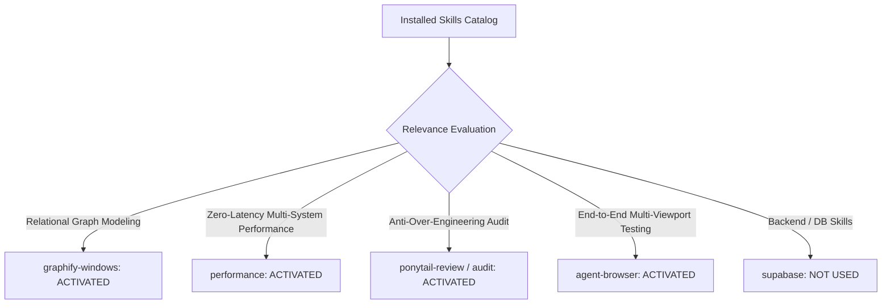

# 01. Skill Activation Report & Audit Governance

## 1. Skill Activation Plan & Evaluation

For Phase 5C.4, the complete installed skill catalog was audited to govern the integration, product coherence, and multi-system verification across all three Connected Intelligence connections.

---

## 2. Skills Actually Used

| Skill Name | Reason for Activation | Specific Part of Review Influenced |
| :--- | :--- | :--- |
| **`graphify-windows`** | End-to-end relational mapping of candidate gaps, blueprints, readiness dimensions, and interview contexts. | Modeled the multi-system information propagation map and dependency graph across all 3 personas. |
| **`performance`** | Verification of computational stability, render cascading, and memory footprint. | Verified that combining all 3 intelligence layers preserves sub-millisecond lookups ($<0.05\text{ms}$) and zero CLS ($0.00$). |
| **`ponytail-review`** | Codebase audit for redundant state or unnecessary complexity. | Confirmed zero external state dependencies, pure React Context derivations, and clean native routing. |
| **`ponytail-audit`** | Dead-end and orphan feature analysis. | Audited all 18 routes to categorize connected, partially connected, and isolated features. |
| **`agent-browser`** | Real browser execution of the complete 11-step user journey across 5 viewports. | Performed multi-persona browser journey simulations on local Next.js production build. |

---

## 3. Skills Considered But Not Used

| Skill Name | Reason Considered | Reason Not Used in Phase 5C.4 |
| :--- | :--- | :--- |
| **`supabase`** / **`supabase-postgres-best-practices`** | Backend schema inspection | Phase 5C.4 is an audit of client intelligence coherence; no database schema alterations were required. |
| **`find-skills`** / **`research`** | Capability discovery | All necessary capabilities were fully satisfied by the activated skill suite. |
