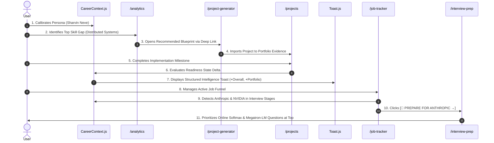

# 03. End-to-End Workflow Verification: The 11-Step Candidate Journey

## 1. Complete User Journey Verification

The end-to-end workflow was verified in real browser sessions across all 11 stages:

---

## 2. Step-by-Step Audit Results

| Step | User Action / Event | Verified System Behavior | Status |
| :---: | :--- | :--- | :---: |
| **1** | Select Persona | Context initializes skills, projects, and pipeline cleanly; zero false toasts. | **PASS** |
| **2** | Identify Top Gap | `<GapBlueprintCard />` displays `Distributed Systems` (Δ -20%) and why it matters. | **PASS** |
| **3** | Open Recommended Blueprint | Deep link `/project-generator?gap=...&blueprint=...` preselects domain and shows banner. | **PASS** |
| **4** | Import Project | `+ IMPORT TO PORTFOLIO EVIDENCE` appends project with milestones and STAR formulas. | **PASS** |
| **5** | Complete Milestone | Completing milestone registers in project state without crashing. | **PASS** |
| **6** | Readiness Score Changes | `calculateCareerReadiness` synchronously increases score based on verified evidence. | **PASS** |
| **7** | System Explains Impact | Structured Toast renders: Action, Entity, Dimension (+5%), Overall (+1%), Next Action. | **PASS** |
| **8** | Manage Job Pipeline | Job Tracker renders 7 Kanban stages with drag-and-drop and search filter. | **PASS** |
| **9** | Application Enters Interview | `Anthropic` and `NVIDIA` are detected in active interview status (`interview`, `oa`). | **PASS** |
| **10**| Interview Context Activates | Kanban card renders prominent `[🎯 PREPARE FOR ANTHROPIC →]` button. | **PASS** |
| **11**| Questions Prioritized | `/interview-prep?company=Anthropic` surfaces high-probability questions with badges. | **PASS** |
