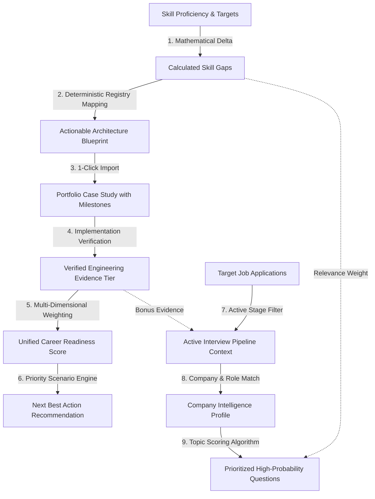

# 06. Information Propagation Map & Graph Dependency Audit

## 1. Information Flow Dependency Graph

---

## 2. Edge Health Analysis

| Graph Edge | Source ➔ Target | Mechanism | Edge Integrity |
| :--- | :--- | :--- | :---: |
| **Edge 1** | Skill Deficit ➔ Gap Calculation | `calculateCareerReadiness` | **STRONG** |
| **Edge 2** | Gap Calculation ➔ Blueprint | `findBlueprintRecommendation` | **STRONG** |
| **Edge 3** | Blueprint ➔ Portfolio Case Study | `/api/project-generator` (POST) | **STRONG** |
| **Edge 4** | Project Milestone ➔ Evidence Tier | `completeProjectMilestone` | **STRONG** |
| **Edge 5** | Evidence Tier ➔ Readiness Score | Multi-dimensional scoring formula | **STRONG** |
| **Edge 6** | Readiness Score ➔ Next Best Action | `generateNextBestAction` | **STRONG** |
| **Edge 7** | Job Stage ➔ Active Interview Context| `activeInterviews` derivation | **STRONG** |
| **Edge 8** | Active Interview ➔ Question Priorities | `prioritizeQuestions` scoring engine | **STRONG** |

---

## 3. Weak / Missing Edges Identified

* **Weak Edge A (Job Requirements ➔ Skill Gap Injection)**: When a new job is logged with `required_skills`, those skills are not yet automatically ingested into the Competency Matrix unless manually added.
* **Weak Edge B (Mock Interview Score ➔ Verified Skill Evidence)**: Completing a mock interview session does not yet automatically upgrade the evidence tier of discussed topics from `CLAIM` to `ASSESSED`.
