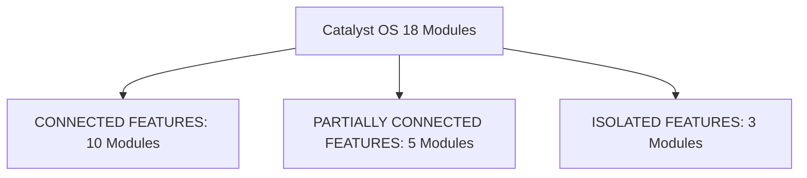

# 12. Dead-End & Orphan Feature Analysis Across 18 Sub-Applications

## 1. Feature Connectedness Categorization

All 18 sub-applications in Catalyst OS were audited using the `ponytail-audit` principles to evaluate their degree of integration with the Connected Intelligence ecosystem:

---

## 2. Comprehensive Connectedness Table

| Sub-Application | Current Route | Connected Intelligence Touchpoints | Category | Next Opportunity |
| :--- | :--- | :--- | :---: | :--- |
| **Executive Overview** | `/` | Readiness Index, Next Best Action, 4 Pillar Deep Links | **CONNECTED** | Surface active interview status directly in Next Best Action card. |
| **Career Analytics** | `/analytics` | Readiness Radar, Gap Resolution Card (Conn A), Pipeline Funnel | **CONNECTED** | Add direct link to active interview question bank. |
| **Competency Matrix** | `/skills` | Skill Gap Map, Inline Blueprint CTAs (Conn A), Sliders | **CONNECTED** | Fully connected to blueprints and interview prep. |
| **System Blueprints** | `/project-generator` | Contextual Resolution Banner (Conn A), Blueprint Preselection | **CONNECTED** | Add return breadcrumb to `/analytics`. |
| **Portfolio Projects** | `/projects` | Milestone Verification, Evidence Tiers, Readiness Delta (Conn B) | **CONNECTED** | Link projects directly to ATS keyword proof. |
| **ATS Keyword Matcher**| `/ats-checker` | Keyword Matcher, `+ INJECT` Evidence Causal Feedback (Conn B) | **CONNECTED** | Export tailored resume markdown directly to Resume Canvas. |
| **Credential Archive** | `/certifications` | Credential Sync, Readiness Delta Feedback (Conn B) | **CONNECTED** | Fully connected to readiness scoring. |
| **Systems Coding** | `/coding-tracker` | Solution Sync, Evidence Upgrades, Readiness Feedback (Conn B) | **CONNECTED** | Auto-link solved algorithms to interview questions. |
| **Application Pipeline**| `/job-tracker` | Kanban Stages, Rejection Feedback Loop, Interview CTAs (Conn C)| **CONNECTED** | Fully connected to Interview Prep. |
| **Technical Question Bank**| `/interview-prep` | Pipeline Switcher, Context Banner, Question Prioritization (Conn C)| **CONNECTED** | Fully connected to Job Pipeline. |
| **Public Portfolio** | `/portfolio/[username]`| Dynamic SSR portfolio reflecting verified case studies | **PARTIALLY CONNECTED**| Add recruiter contact CTA linking back to active interviewers. |
| **Resume Canvas** | `/resume-builder` | Displays candidate resume, but edits are saved locally | **PARTIALLY CONNECTED**| Ingest injected ATS keywords directly into resume bullets. |
| **Pitch Studio** | `/cover-letter` | Generates cover letters, but company is entered manually | **PARTIALLY CONNECTED**| Auto-fill target company and job requirements from Job Tracker. |
| **Mock Interview** | `/mock-interview` | AI simulation rounds with scoring | **PARTIALLY CONNECTED**| Auto-import company context from active interview pipeline. |
| **Research Library** | `/resources` | Reading list with search and tags | **PARTIALLY CONNECTED**| Link papers directly to technical questions and blueprints. |
| **Triton Latency Sandbox**| `/algorithm-sandbox`| Interactive GPU kernel latency simulation tool | **ISOLATED** | Link Triton sandbox benchmarks directly to PyTorch skill proof. |
| **GitHub Evidence** | `/github` | Commit graph and repository explorer | **ISOLATED** | Auto-verify GitHub repository URLs in Portfolio case studies. |
| **Compensation & Equity**| `/salary-insights` | Salary percentiles and equity calculator | **ISOLATED** | Link offer compensation data directly to Job Tracker offer stage. |
