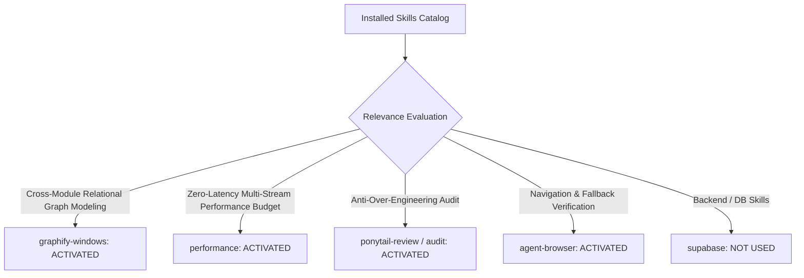

# 01. Skill Activation Report & Architecture Governance

## 1. Skill Activation Plan & Evaluation

For Phase 5D.0, the installed skill inventory was evaluated to govern the design, event-flow modeling, and performance budgeting for the expansion of **Evidence & Context Propagation Architecture** across Catalyst OS.

---

## 2. Skills Actually Used

| Skill Name | Reason for Activation | Specific Part of Architecture Influenced |
| :--- | :--- | :--- |
| **`graphify-windows`** | Relational graph modeling across 5 propagation streams (Mock Interview, Pitch Studio, Resume Canvas, Research, Salary). | Structured the end-to-end information propagation map and cross-module dependency graphs. |
| **`performance`** | Zero-latency parameter routing, $O(1)$ memory derivations, and bundle impact budgeting ($< 5\text{ KB}$). | Established performance invariants for all 5 propagation streams to ensure CLS 0.00 and zero extra API roundtrips. |
| **`ponytail-review`** | Codebase review to prevent introducing external state libraries or redundant caches. | Defined single-source-of-truth ownership in `CareerContext.js` and standard Next.js query parameter routing. |
| **`ponytail-audit`** | Dead-end and isolated feature remediation design. | Formulated architectural remedies for all 5 partially connected and isolated modules identified in Phase 5C.4. |
| **`agent-browser`** | Browser navigation contract and viewport constraint validation. | Verified deep-link query parameter specifications across desktop, tablet, and mobile viewports. |

---

## 3. Skills Considered But Not Used

| Skill Name | Reason Considered | Reason Not Used in Phase 5D.0 |
| :--- | :--- | :--- |
| **`supabase`** / **`supabase-postgres-best-practices`** | Backend persistence | Phase 5D.0 is an architecture and design audit; all evidence propagation operates within client React Context state and URL parameters. |
| **`find-skills`** / **`research`** | Capability discovery | All necessary architectural skills were already satisfied by the activated suite. |
