# 02. Evidence & Context Propagation Scope

## 1. Executive Problem Statement

In Phase 5C.4, Catalyst OS achieved an **88 / 100 Coherence Score** by establishing Connections A, B, and C.

However, five key modules remained partially connected or isolated:
1. **Mock Interview (`/mock-interview`)**: Simulation tracks do not inherit active interview company context from Job Tracker.
2. **Pitch Studio (`/cover-letter`)**: Cover letters and recruiter pitches do not automatically import target company requirements or candidate case studies.
3. **Resume Canvas (`/resume-builder`)**: ATS keyword proofs injected in `/ats-checker` do not automatically sync into active resume bullet points.
4. **Research Library (`/resources`)**: Empirical research citations in blueprints and interview questions do not connect to the reading log.
5. **Salary Insights (`/salary-insights`)**: Offer compensation in Job Tracker is not auto-modeled for equity waterfalls or negotiation scripts.

---

## 2. The 5 Propagation Streams

```mermaid
graph TD
    subgraph STREAM 1 [Connection D: Mock Interview Intelligence]
        J1[Job Pipeline Interview] -->|Auto-Calibrate Track & Rubric| MI[AI Mock Interview Simulator]
        MI -->|Sync Simulation Score| R1[Structured Readiness Delta Feedback]
    end

    subgraph STREAM 2 [Connection E: Pitch Studio Intelligence]
        J2[Job Pipeline Target] -->|1-Click Tailored Generation| PS[Pitch Studio / Cover Letter]
        CC2[Career Projects & Gaps] -->|Inject STAR Case Studies| PS
    end

    subgraph STREAM 3 [Connection F: Resume Canvas Evidence Sync]
        ATS[ATS Proof Injector] -->|Generate Verified Bullet| RC[Resume Canvas Experience Bullets]
    end

    subgraph STREAM 4 [Connection G: Research Citation Deep-Linking]
        IQ[Interview Questions & Blueprints] -->|Deep-Link Citations| RL[Research Library Reading Log]
        RL -->|Sync Read Status| R2[Core Competency Evidence Boost]
    end

    subgraph STREAM 5 [Connection H: Offer Stage & Equity Modeling]
        J3[Job Pipeline Offer Stage] -->|Auto-Populate Offer Data| SI[Salary & Equity Modeler]
    end
```

