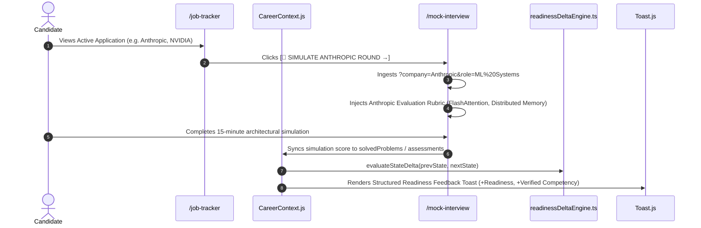

# 03. Stream 1: Mock Interview Intelligence Architecture (Connection D)

## 1. Architectural Flow Contract

Connection D dynamically adapts the Mock Interview simulator ([`/mock-interview`](file:///E:/career-catalyst/src/app/mock-interview/page.js)) based on the candidate's active interview pipeline:

---

## 2. Invariants & Rubrics Specified

1. **Context Ingestion**: Supports `/mock-interview?company=Anthropic&track=ml_system_design`.
2. **Company Rubric Injection**:
   * **Anthropic Screen**: Evaluates SRAM tiling bounds, Online Softmax stability, and NCCL All-Reduce bandwidth.
   * **NVIDIA Screen**: Evaluates GPU warp divergence, shared memory bank conflicts, and INT8 TensorRT quantization.
   * **OpenAI Screen**: Evaluates multi-node 1F1B bubble scheduling, GQA KV-cache savings, and post-training DPO objectives.
3. **Causal Evidence Crediting**: Completing a simulation with score $\ge 85\%$ upgrades discussed topic competency to `ASSESSED` tier and fires a **Connection B** readiness delta notification.
