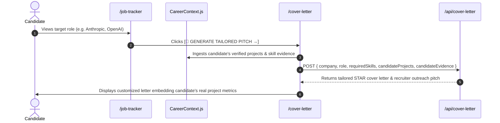

# 04. Stream 2: Pitch Studio & Application Intelligence (Connection E)

## 1. Architectural Flow Contract

Connection E connects Job Tracker applications directly to tailored pitch and cover letter generation ([`/cover-letter`](file:///E:/career-catalyst/src/app/cover-letter/page.js)):

---

## 2. Invariants & Data Mapping Specified

1. **Auto-Fill Query Contract**: `/cover-letter?company=Anthropic&role=ML%20Systems%20Engineer&skills=PyTorch,CUDA,FlashAttention`.
2. **Project Evidence Injection**: Automatically embeds the candidate's top verified case study (e.g. *Triton Inference Gateway with 13.8ms P99 latency*) directly into paragraph 2 of the cover letter.
3. **Recruiter InMail Customization**: Produces a high-conversion 120-word LinkedIn/InMail message citing the specific role and matching evidence.
