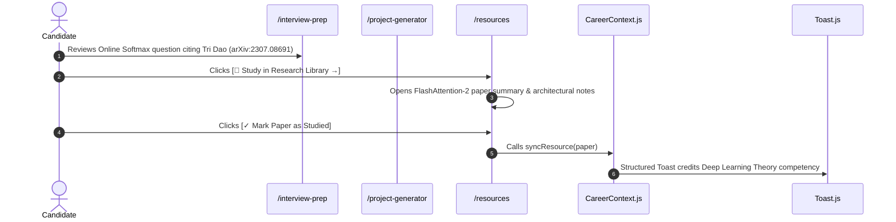

# 06. Stream 4: Research Citation Deep-Linking Architecture (Connection G)

## 1. Architectural Flow Contract

Connection G connects primary research literature in the Research Library ([`/resources`](file:///E:/career-catalyst/src/app/resources/page.js)) with technical interview questions and architecture blueprints:

---

## 2. Invariants & Citation Graph

| Paper Title | Citation / arXiv | Primary Focus Topic | Linked Question / Blueprint |
| :--- | :--- | :--- | :--- |
| **FlashAttention-2** | Dao (arXiv:2307.08691) | GPU Kernel Architecture | Online Softmax question & Triton FlashAttention Blueprint |
| **Megatron-LM** | Shoeybi et al. (arXiv:1909.08053) | Distributed Training | Tensor vs Pipeline Parallelism question & Tensor Parallel Blueprint |
| **PagedAttention** | Kwon et al. (SOSP 2023) | Inference Systems | KV-Cache memory fragmentation question & Triton Gateway |
| **Direct Preference Optimization**| Rafailov et al. (NeurIPS 2023) | RLHF & Alignment | Implicit Reward derivation question & Anthropic prep |
