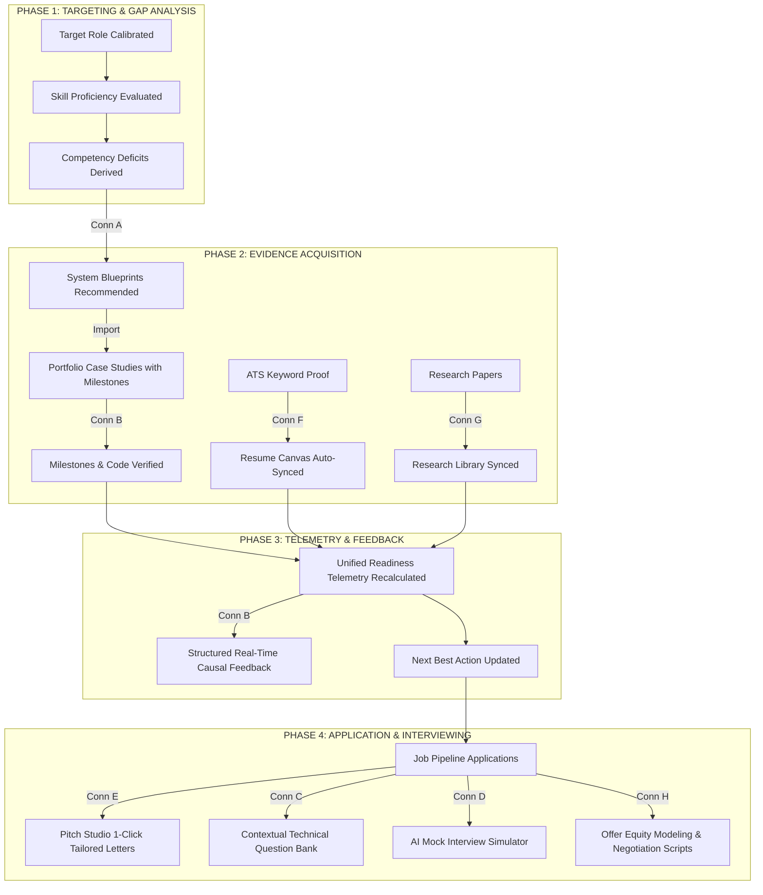

# 08. Cross-Module Event Flow Model & Unified Intelligence Ecosystem

## 1. Unified Event Flow Diagram

---

## 2. Event Propagation Table

| Event / Mutation | Originating Page | Target Destination | Propagated Payload |
| :--- | :--- | :--- | :--- |
| `BLUEPRINT_RECOMMENDED` | `/analytics`, `/skills` | `/project-generator` | `{ gapId, blueprintId, domain }` |
| `ATS_EVIDENCE_INJECTED` | `/ats-checker` | `/resume-builder` | `{ skillName, projectName, formattedBullet }` |
| `MILESTONE_COMPLETED` | `/projects` | Global Toast, Dashboard | `{ projectId, milestoneName, scoreDelta }` |
| `INTERVIEW_ACTIVE` | `/job-tracker` | `/interview-prep`, `/mock-interview` | `{ company, role, stage, focusTopics }` |
| `OFFER_RECEIVED` | `/job-tracker` | `/salary-insights` | `{ company, role, base, equity, bonus }` |
| `RESEARCH_STUDIED` | `/resources` | `/interview-prep`, Dashboard | `{ paperId, topic, theoryCompetencyBoost }` |
