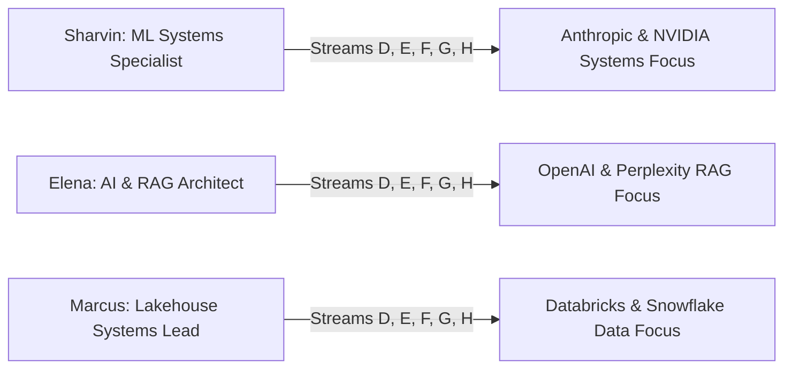

# 10. Multi-Persona Evidence Propagation Matrix

## 1. Persona Multi-Stream Propagation Matrix

The full 5-stream propagation ecosystem is designed to adapt deterministically to each candidate persona:

---

## 2. Multi-Persona Stream Breakdown

| Stream | 🚀 Sharvin Neve (ML Systems) | 🤖 Elena Rostova (AI & RAG) | ⚡ Marcus Vance (Data Systems) |
| :--- | :--- | :--- | :--- |
| **Stream 1 (Mock Interview)** | `Anthropic Systems Screen`: FlashAttention-2, Megatron-LM | `OpenAI Technical Round`: RAGAS Evaluation, Agentic Workflows | `Databricks Architecture Panel`: Delta Lake, Photon Engine |
| **Stream 2 (Pitch Studio)** | Embeds *Triton Inference Gateway* (13.8ms p99) into Anthropic cover letter | Embeds *Agentic Research Engine* (96.4% factual accuracy) into OpenAI pitch | Embeds *10TB Streaming Lakehouse* into Databricks proposal |
| **Stream 3 (Resume Canvas)** | Injects verified `Triton GPU Kernel` bullet | Injects verified `Qdrant / RRF Hybrid Search` bullet | Injects verified `Apache Iceberg Partitioning` bullet |
| **Stream 4 (Research Citations)** | Deep-links Tri Dao *FlashAttention-2* (`arXiv:2307.08691`) | Deep-links Rafailov *Direct Preference Optimization* (`arXiv:2305.18290`) | Deep-links Armbrust *Delta Lake: High-Performance ACID* |
| **Stream 5 (Offer Modeling)** | Models $210k base + $120k equity for Anthropic Staff AI role | Models $195k base + $95k equity for OpenAI Senior ML role | Models $185k base + $85k equity for Databricks Lead role |
