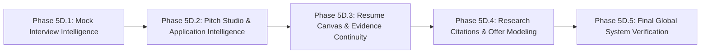

# 14. Implementation Roadmap: Execution Sub-Phases

## 1. Modular Execution Sub-Phases

To ensure systematic, high-integrity implementation, the evidence propagation architecture is partitioned into focused, testable sub-phases:

---

## 2. Sub-Phase Scope Details

1. **Phase 5D.1: Mock Interview Intelligence (Connection D)**:
   * Implement company context ingestion in `/mock-interview`.
   * Add company simulation tracks (Anthropic, NVIDIA, OpenAI, Databricks).
   * Wire simulation score completions into `CareerContext` with **Connection B** readiness feedback.

2. **Phase 5D.2: Pitch Studio & Application Intelligence (Connection E)**:
   * Add `[📝 GENERATE TAILORED PITCH →]` CTA on Job Tracker cards.
   * Auto-fill target company, role requirements, and verified project case studies into `/cover-letter`.

3. **Phase 5D.3: Resume Canvas & Evidence Continuity (Connection F)**:
   * Auto-sync injected ATS proofs from `/ats-checker` into `/resume-builder`.
   * Add 1-click bullet point appending with empirical metrics.

4. **Phase 5D.4: Research Citations & Offer Modeling (Connections G & H)**:
   * Connect research paper citations in `/interview-prep` and `/project-generator` to `/resources`.
   * Connect Job Tracker `offer` stage cards to `/salary-insights` with auto-populated equity waterfalls.

5. **Phase 5D.5: Final Global System Verification**:
   * Complete end-to-end multi-persona regression and browser testing across all 18 sub-applications.
