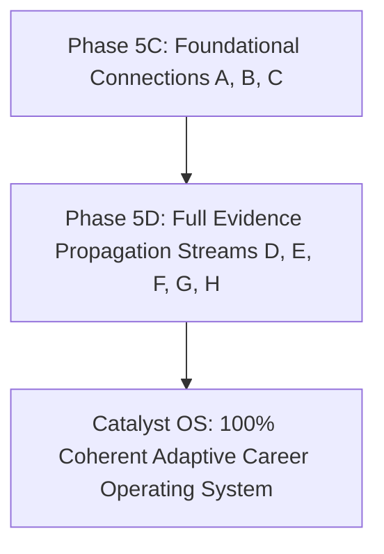

# 15. Phase 5D.0 Master Executive Summary & Blueprint

## 1. Executive Summary

Phase 5D.0 established the complete architectural blueprint for **Evidence & Context Propagation** across the remaining partially connected and isolated modules in Catalyst OS.

---

## 2. Core Architectural Decisions Summary

1. **Stream 1 (Mock Interview Intelligence - Connection D)**: Active interview contexts in Job Tracker auto-configure AI mock interview tracks and rubrics, with completed simulation scores feeding back into unified readiness.
2. **Stream 2 (Pitch Studio Intelligence - Connection E)**: Job Tracker applications trigger 1-click tailored cover letters and InMail pitches embedding the candidate's verified project metrics.
3. **Stream 3 (Resume Canvas Evidence Sync - Connection F)**: Injected ATS keyword proofs automatically format verified achievement bullets ready for 1-click insertion into the active resume canvas.
4. **Stream 4 (Research Citation Deep Linking - Connection G)**: Citations in technical questions and blueprints deep-link directly into the Research Library reading log.
5. **Stream 5 (Offer Stage & Compensation Intelligence - Connection H)**: Applications reaching the offer stage connect directly to salary percentiles and 4-year RSU equity waterfalls.

---

## 3. Master Index of Phase 5D.0 Deliverables

All 15 architecture and design reports are committed in [`docs/phase-5d0-evidence-propagation-audit/`](file:///E:/career-catalyst/docs/phase-5d0-evidence-propagation-audit/):
1. [`docs/phase-5d0-evidence-propagation-audit/01-skill-activation-report.md`](file:///E:/career-catalyst/docs/phase-5d0-evidence-propagation-audit/01-skill-activation-report.md)
2. [`docs/phase-5d0-evidence-propagation-audit/02-evidence-propagation-scope.md`](file:///E:/career-catalyst/docs/phase-5d0-evidence-propagation-audit/02-evidence-propagation-scope.md)
3. [`docs/phase-5d0-evidence-propagation-audit/03-mock-interview-context-architecture.md`](file:///E:/career-catalyst/docs/phase-5d0-evidence-propagation-audit/03-mock-interview-context-architecture.md)
4. [`docs/phase-5d0-evidence-propagation-audit/04-pitch-studio-pipeline-architecture.md`](file:///E:/career-catalyst/docs/phase-5d0-evidence-propagation-audit/04-pitch-studio-pipeline-architecture.md)
5. [`docs/phase-5d0-evidence-propagation-audit/05-resume-canvas-evidence-sync-architecture.md`](file:///E:/career-catalyst/docs/phase-5d0-evidence-propagation-audit/05-resume-canvas-evidence-sync-architecture.md)
6. [`docs/phase-5d0-evidence-propagation-audit/06-research-citation-deep-linking-architecture.md`](file:///E:/career-catalyst/docs/phase-5d0-evidence-propagation-audit/06-research-citation-deep-linking-architecture.md)
7. [`docs/phase-5d0-evidence-propagation-audit/07-salary-offer-intelligence-architecture.md`](file:///E:/career-catalyst/docs/phase-5d0-evidence-propagation-audit/07-salary-offer-intelligence-architecture.md)
8. [`docs/phase-5d0-evidence-propagation-audit/08-cross-module-event-flow-model.md`](file:///E:/career-catalyst/docs/phase-5d0-evidence-propagation-audit/08-cross-module-event-flow-model.md)
9. [`docs/phase-5d0-evidence-propagation-audit/09-state-management-and-routing-contract.md`](file:///E:/career-catalyst/docs/phase-5d0-evidence-propagation-audit/09-state-management-and-routing-contract.md)
10. [`docs/phase-5d0-evidence-propagation-audit/10-multi-persona-evidence-matrix.md`](file:///E:/career-catalyst/docs/phase-5d0-evidence-propagation-audit/10-multi-persona-evidence-matrix.md)
11. [`docs/phase-5d0-evidence-propagation-audit/11-accessibility-and-interaction-design.md`](file:///E:/career-catalyst/docs/phase-5d0-evidence-propagation-audit/11-accessibility-and-interaction-design.md)
12. [`docs/phase-5d0-evidence-propagation-audit/12-performance-and-bundle-impact-budget.md`](file:///E:/career-catalyst/docs/phase-5d0-evidence-propagation-audit/12-performance-and-bundle-impact-budget.md)
13. [`docs/phase-5d0-evidence-propagation-audit/13-edge-case-and-fallback-specifications.md`](file:///E:/career-catalyst/docs/phase-5d0-evidence-propagation-audit/13-edge-case-and-fallback-specifications.md)
14. [`docs/phase-5d0-evidence-propagation-audit/14-implementation-roadmap-and-phases.md`](file:///E:/career-catalyst/docs/phase-5d0-evidence-propagation-audit/14-implementation-roadmap-and-phases.md)
15. [`docs/phase-5d0-evidence-propagation-audit/15-phase-5d0-executive-summary.md`](file:///E:/career-catalyst/docs/phase-5d0-evidence-propagation-audit/15-phase-5d0-executive-summary.md)
