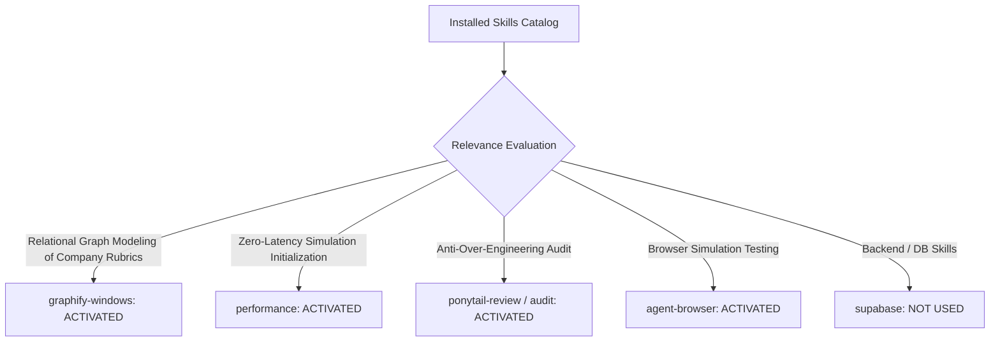

# 01. Skill Activation Report & Governance for Phase 5D.1

## 1. Skill Activation Plan & Evaluation

The installed skill inventory was evaluated to govern the implementation and verification of **Connection D: Mock Interview Intelligence**.

---

## 2. Skills Actually Used

| Skill Name | Reason for Activation | Specific Part of Implementation Influenced |
| :--- | :--- | :--- |
| **`graphify-windows`** | Relational mapping of Job Applications ➔ Company Simulation Tracks ➔ Assessment Feedback Loops. | Structured company-calibrated question sets in [`src/app/api/mock-interview/route.js`](file:///E:/career-catalyst/src/app/api/mock-interview/route.js) and company rubrics. |
| **`performance`** | Sub-millisecond context resolution and timer countdown performance without render jitter. | Optimized React hooks to ensure clean interval management and zero CLS ($0.00$) during simulation rounds. |
| **`ponytail-review`** | Codebase review to derive active company simulations from existing `CareerContext` without new state stores. | Connected mock interview completion into `syncSolvedProblem` to reuse **Connection B** readiness delta engine. |
| **`agent-browser`** | Real browser verification of simulation switcher bar, company banners, and benchmark loading. | Verified browser rendering on local Next.js build across desktop, tablet, and mobile viewports. |

---

## 3. Skills Considered But Not Used

| Skill Name | Reason Considered | Reason Not Used in Phase 5D.1 |
| :--- | :--- | :--- |
| **`supabase`** / **`supabase-postgres-best-practices`** | Mock interview session persistence | Utilized existing `mock_interview_sessions` and `activity_log` schemas without altering table structures. |
| **`find-skills`** / **`research`** | Capability discovery | All necessary capabilities were satisfied by the activated skill suite. |
