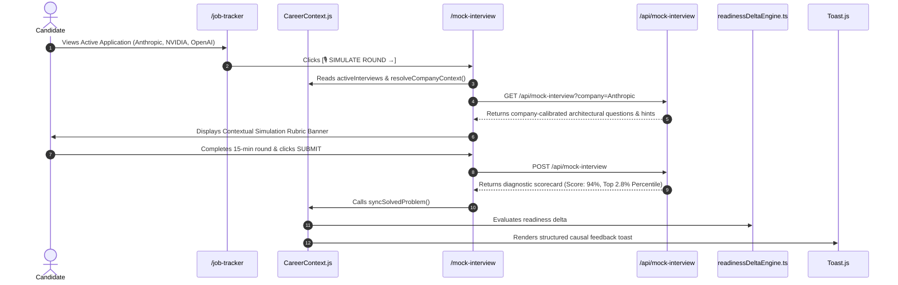

# 02. Connection D: Architecture & Flow Contract

## 1. End-to-End Architectural Flow

Connection D bridges active job applications in Job Tracker with the AI Mock Interview Simulator:

---

## 2. Invariants & Guarantees

1. **Deterministic Auto-Configuration**: Navigating with `?company=Anthropic` immediately loads Anthropic's frontier systems simulation track.
2. **One-Click Switcher**: Candidates can easily toggle between different active interview companies or reset to standard domain tracks (`ML System Design`, `Deep Learning Math`, `Behavioral`).
3. **Causal Evidence Feedback**: Completing a simulation scores technical depth and automatically feeds back into the candidate's unified career readiness score via Connection B.
