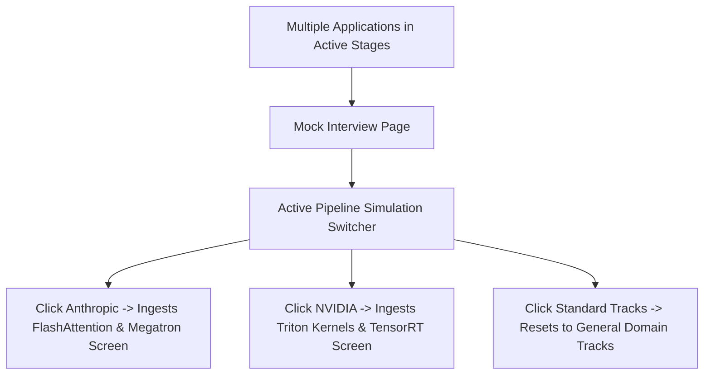

# 07. Multiple Active Interview Handling Specification

## 1. Multiple Active Applications Strategy

---

## 2. Invariants Enforced

1. **Precedence**: `?company=...` URL search parameter determines current simulation track.
2. **Context Switching**: Clicking a different company in the toolbar updates the router and dynamically fetches the company's calibrated question set without a full page refresh.
3. **Clean Reset**: Clicking `Standard Tracks ✕` resets the view to the 3 default tracks (`ML System Design`, `Deep Learning Math`, `Behavioral & Leadership`).
