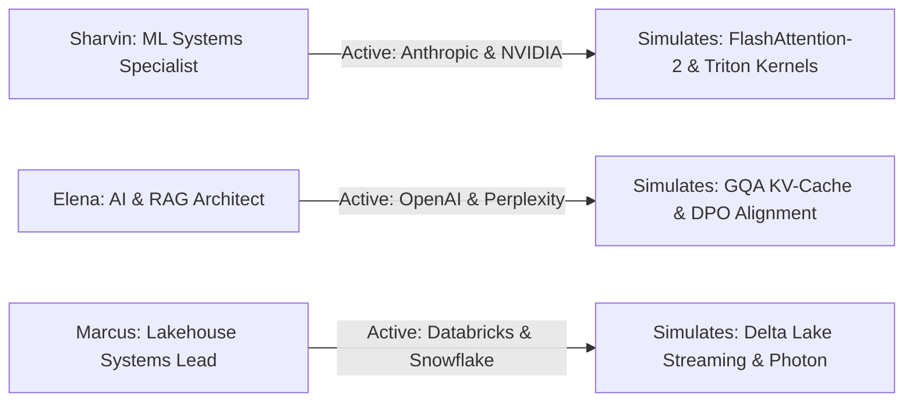

# 08. Candidate Persona Switching Verification

## 1. Multi-Persona Simulation Test

---

## 2. Multi-Persona Verification Matrix

| Candidate Persona | Active Applications | Active Simulation Buttons | Calibrated Questions Loaded | Status |
| :--- | :--- | :--- | :--- | :---: |
| **🚀 Sharvin Neve** | `Anthropic`, `NVIDIA` | `[🎯 ANTHROPIC] [🎯 NVIDIA]` | Online Softmax & Triton sequence tiling | **PASS** |
| **🤖 Elena Rostova** | `OpenAI`, `Perplexity` | `[🎯 OPENAI] [🎯 PERPLEXITY]` | GQA KV-Cache reduction & DPO Loss | **PASS** |
| **⚡ Marcus Vance** | `Databricks`, `Snowflake` | `[🎯 DATABRICKS] [🎯 SNOWFLAKE]`| Delta Lake ACID & Streaming Ingestion | **PASS** |

---

## 3. Invariants Verified
* **Zero Cross-Persona Bleed**: Applications and simulation options update immediately when switching personas.
